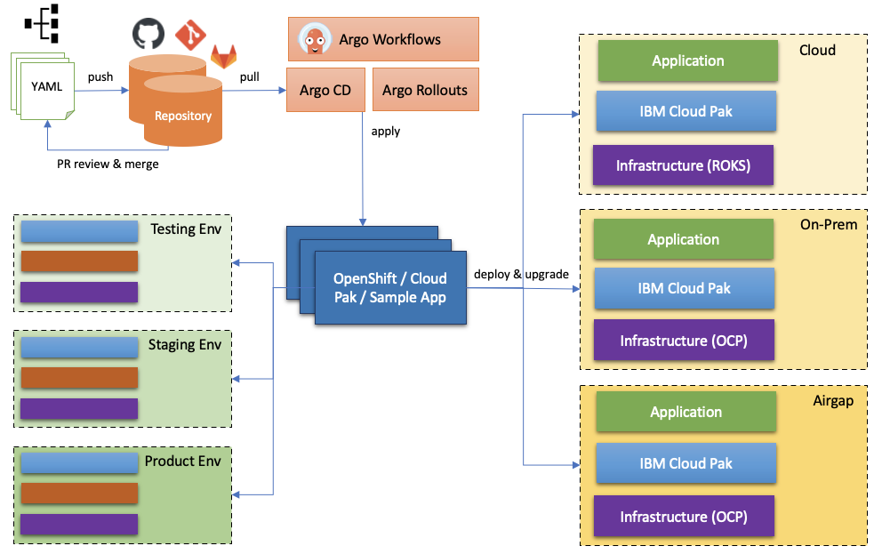

<!-- START doctoc generated TOC please keep comment here to allow auto update -->
<!-- DON'T EDIT THIS SECTION, INSTEAD RE-RUN doctoc TO UPDATE -->
**Table of Contents**  *generated with [DocToc](https://github.com/thlorenz/doctoc)*

- [Deploy Cloud Pak for Watson AIOps using GitOps](#deploy-cloud-pak-for-watson-aiops-using-gitops)
  - [Use Cases](#use-cases)
  - [Supported CP4WAIOps Versions](#supported-cp4waiops-versions)
  - [Install CP4WAIOps using GitOps](#install-cp4waiops-using-gitops)
  - [More Install Options for CP4WAIOps using GitOps](#more-install-options-for-cp4waiops-using-gitops)

<!-- END doctoc generated TOC please keep comment here to allow auto update -->

# Deploy Cloud Pak for Watson AIOps using GitOps

This repository is about using OpenShift GitOps to deployCloud Pak for Watson AIOps(CP4WAIOps) on Red Hat OpenShift Cluster.

## Use Cases

- As a Cluster Admin, I want to install Cloud Pak from scratch using GitOps, and track the Cluster update via Git Commit log. (Day 1 Operation)
- As a Cluster Admin, I want to modify, upgrade existing Cloud Pak deployment using GitOps. (Day 2 Operation)
- As a Cluster Admin, I want to have the same install experience for all Cloud Paks via GitOps. (Consistent Install Experience)
- As a Cluster Admin, I want to install Cloud Pak in airgap environment using GitOps. (Airgap Install)
- As a Cluster Admin, I want to provision OpenShift cluster using GitOps. (OCP Provisioning)
- As a Cluster Admin, I want to promote Cloud Pak from development, staging, to production environment using GitOps. (Continuous Delivery)
- As an Application Developer, I want to deploy applications to IBM Cloud Paks via GitOps. (Application Deployment)

## Supported CP4WAIOps Versions

- [3.1](https://www.ibm.com/docs/en/cloud-paks/cloud-pak-watson-aiops/3.1.0) - NON OFFICIAL GITOPS RELEASE, NO OFFICIAL SUPPORT
- [3.2](https://www.ibm.com/docs/en/cloud-paks/cloud-pak-watson-aiops/3.2.0) - NON OFFICIAL GITOPS RELEASE, NO OFFICIAL SUPPORT
- [3.3](https://www.ibm.com/docs/en/cloud-paks/cloud-pak-watson-aiops/3.3.0) - TECHNICAL PREVIEW
- [3.4](https://www.ibm.com/docs/en/cloud-paks/cloud-pak-watson-aiops/3.3.0) - OFFICIAL SUPPORT

## Install CP4WAIOps using GitOps

Please refer to the following documents and decide how you want to deploy CP4WAIOps:

- [CP4WAIOps 3.1 Online Install](./docs/how-to-deploy-cp4waiops-31.md)
- [CP4WAIOps 3.2 Online Install](./docs/how-to-deploy-cp4waiops-32.md)
- [CP4WAIOps 3.2 Airgap Install](./docs/how-to-deploy-airgap-32.md)
- [CP4WAIOps 3.3 Tech Preview Online Install](./docs/how-to-deploy-cp4waiops-33.md)
- [CP4WAIOps 3.4 Online Install](./how-to-deploy-cp4waiops.md)

## More Install Options for CP4WAIOps using GitOps

There are some advanced configuration available for CP4WAIOps to support more install scenarios. Also, as a customer, you may want to fork this repository to customize it that meets your specific needs. For more details, please refer to [Customize CP4WAIOps Install](./cp4waiops-custom-install.md).
