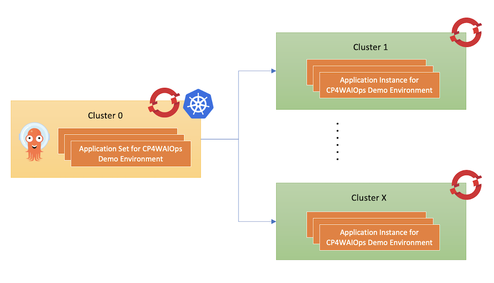
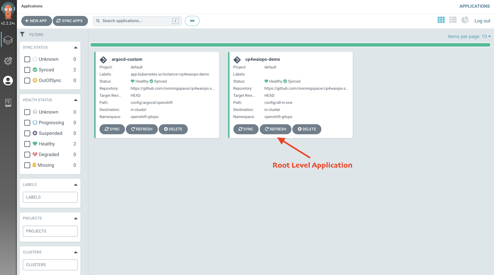
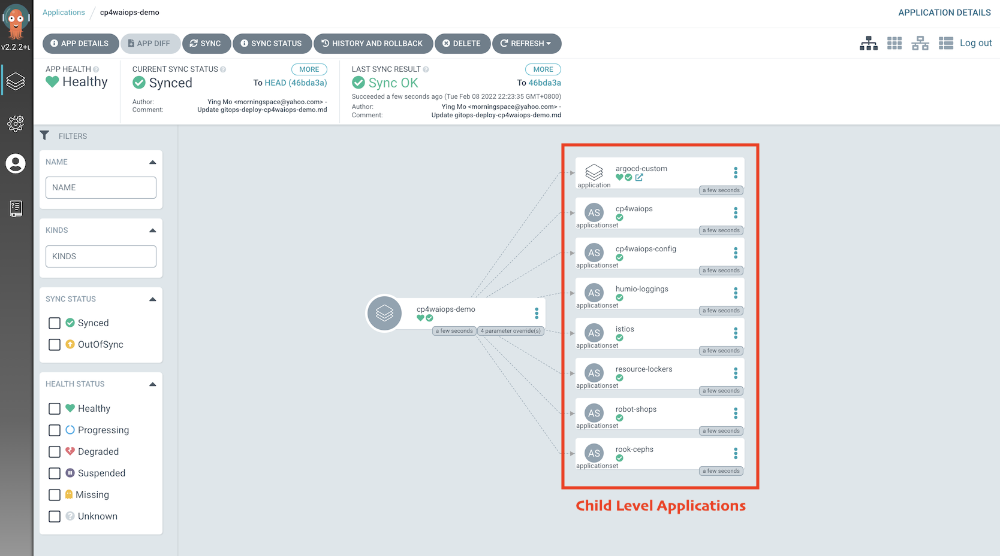
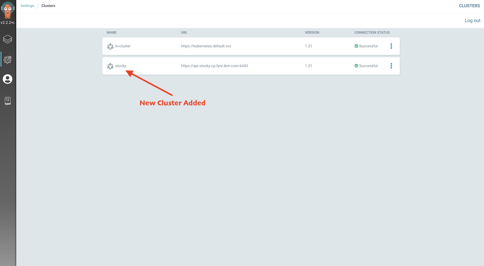
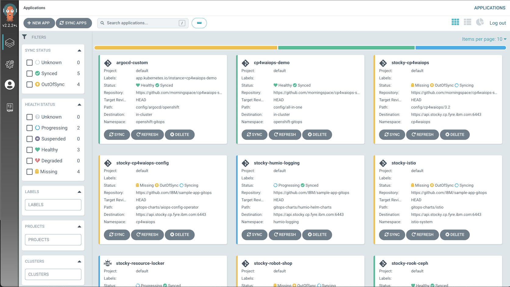
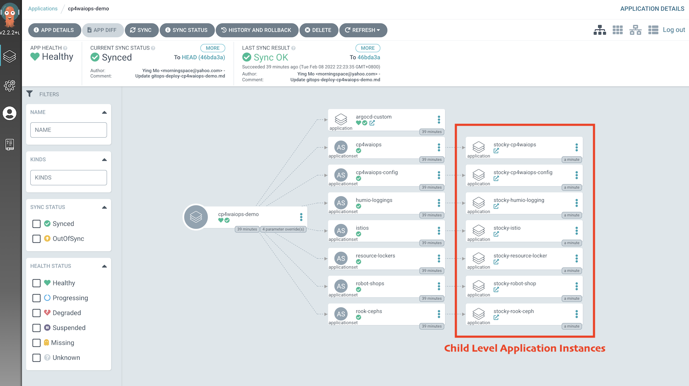
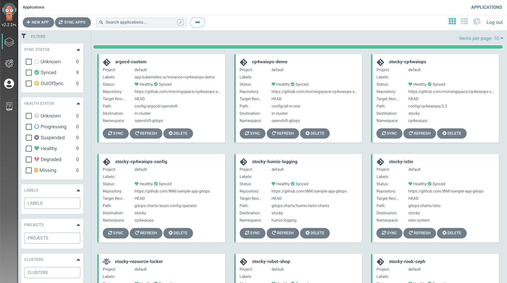
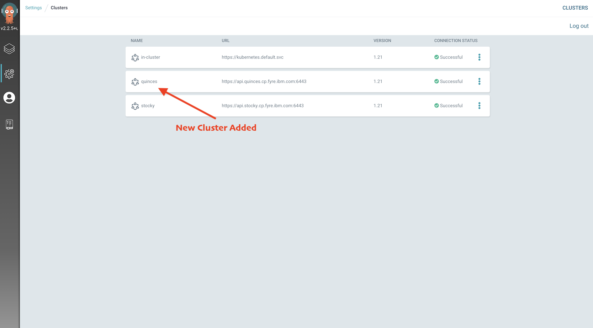
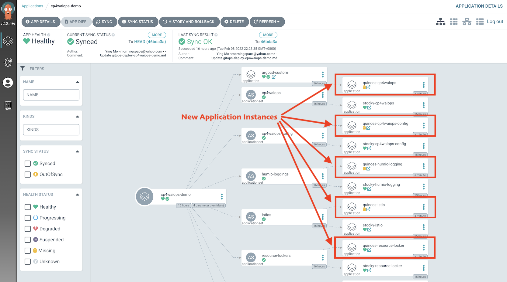

<!-- START doctoc generated TOC please keep comment here to allow auto update -->
<!-- DON'T EDIT THIS SECTION, INSTEAD RE-RUN doctoc TO UPDATE -->
**Table of Contents** *generated with [DocToc](https://github.com/thlorenz/doctoc)*

- [Deploy Cloud Pak for Watson AIOps demo environment to multiple clusters](#deploy-cloud-pak-for-watson-aiops-demo-environment-to-multiple-clusters)
  - [Prepare environments](#prepare-environments)
  - [Install the Argo CD CLI](#install-the-argo-cd-cli)
  - [Install Cloud Pak for Watson AIOps demo environment](#install-cloud-pak-for-watson-aiops-demo-environment)
  - [Add cluster into Argo CD](#add-cluster-into-argo-cd)
  - [Add more clusters](#add-more-clusters)

<!-- END doctoc generated TOC please keep comment here to allow auto update -->

# Deploy Cloud Pak for Watson AIOps demo environment to multiple clusters

Learn how to deploy the same IBM Cloud Pak for Watson AIOps demo environment to multiple clusters with GitOps.

## Prepare environments

You need at least one cluster to host Argo CD, and one or more clusters to deploy the Cloud Pak for Watson AIOps demonstration environment, which is illustrated in following diagram:



NOTE:

* `cluster 0` is used to host the Argo CD instance. It can be a Red Hat OpenShift cluster or a vanilla Kubernetes cluster that does not require too much resource, since Argo CD is lightweight and supports both Red Hat OpenShift and vanilla Kubernetes.
* `cluster 1` - `cluster x` are used to deploy Cloud Pak for Watson AIOps demonstration environments. If you are looking for an extremely small Cloud Pak for Watson AIOps deployment with all of the default components, sample applications, and other dependencies on the same cluster for a demonstration or proof-of-concept, then a cluster with three worker nodes where each node has 16 cores CPU and 32 GB memory is recommended. If you require a production deployment, see [System Requirements](https://www.ibm.com/docs/en/cloud-paks/cloud-pak-watson-aiops/3.3.0?topic=requirements-ai-manager).

## Install the Argo CD CLI

The Argo CD CLI (the `argocd` command) is needed to add clusters to Argo CD so that Argo CD can deploy the Cloud Pak for Watson AIOps demo environment to those clusters.

To install Argo CD CLI, see the [Argo CD online document](https://argo-cd.readthedocs.io/en/stable/cli_installation/). You can install and run Argo CD CLI on any machine such as your notebook, since it is just a client tool that is used to connect to the Argo CD server.

## Install Cloud Pak for Watson AIOps demo environment

After Argo CD and Argo CD CLI are installed, you can deploy a Cloud Pak for Watson AIOps demonstration environment from the Argo CD UI. To install a Cloud Pak for Watson AIOps demonstration environment, refer to [Install Cloud Pak for Watson AIOps Demo Environment](./deploy-cloudpak-with-sample-apps.md).

The only difference when you set the installation parameters is that:

- `argocd.allowLocalDeploy` must be set to `false`. This is to avoid the Cloud Pak for Watson AIOps demonstration environment from being deployed on the same cluster where Argo CD runs, since in this case that cluster is dedicated to running Argo CD.

After you create the Argo CD App, you can see something similar to the following on the Argo CD UI:



You can only see the root level Argo CD App as no other child level Apps are created for now. This is because no other cluster has been added into Argo CD to deploy the actual Cloud Pak for Watson AIOps demonstration environment yet. If you click the root level App and go into it, then you can see all of the child level App definitions that are listed as follows:



Depending on the installation parameters that you specified when you created the root level Argo CD App, you can enable or disable some of the Apps according to your specific needs. In this case, all available Apps are enabled including Cloud Pak for Watson AIOps, Robot Shop, Humio, Istio, and so on. They are deployed to the target cluster that is going to be added into Argo CD later.

## Add cluster into Argo CD

If you use the Red Hat OpenShift cluster to host Argo CD, then to add the cluster into Argo CD, you need to log in to the cluster that runs Argo CD with the `oc login` command, and then run the following commands to log in to Argo CD with the Argo CD CLI:

```sh
ARGO_HOST=$(oc get route openshift-gitops-server -n openshift-gitops -o jsonpath='{.spec.host}')
ARGO_PASSWORD=$(oc get secret openshift-gitops-cluster -n openshift-gitops -o "jsonpath={.data['admin\.password']}" | base64 -d)
argocd login --username admin --password $ARGO_PASSWORD $ARGO_HOST --insecure
```

Next, log in to the target cluster that will be used to deploy the Cloud Pak for Watson AIOps demonstration environment, again with the `oc login` command. Then, run the following commands to add that cluster into Argo CD with the Argo CD CLI:

```sh
CLUSTER_NAME=stocky
CURRENT_CONTEXT=$(oc config current-context)
argocd cluster add $CURRENT_CONTEXT --name $CLUSTER_NAME
```

Here, a short name for the cluster is given using `CLUSTER_NAME` and is passed into the Argo CD CLI by the argument `--name`.

Next, go to `Settings` > `Clusters` from the Argo CD UI. The newly added cluster is listed as follows.



Go to `Applications` to see all the child level Apps being created automatically, without any additional manual intervention.



Click the root level App and go into it to see that for each child level App definition there is a corresponding App instance that is linked to it. This is the actual application being deployed to the target cluster that was just added into Argo CD.



Depending on the installation parameters that you specified when creating the root level App, it usually takes 1 hour to finish the installation of Cloud Pak for Watson AIOps, and 10 minutes to finish all of the other applications deployments including Ceph, Robot Shop, Humio, Istio, and so on. When you see all of the Apps turning green, (`Synced` and `Healthy`), then the installation of the Cloud Pak for Watson AIOps demonstration environment is complete on the target cluster.



## Add more clusters

To add more clusters to deploy more Cloud Pak for Watson AIOps demonstration environments, repeat these steps to add clusters into Argo CD. Argo CD detects these clusters and deploys applications to these clusters automatically. For example, after you add the second cluster, you can see that the newly added cluster is added to the `Clusters` view from Argo CD UI:



You can also see that each child level App definition now maps to two App instances, and that each instance represents the actual application that is getting deployed to a separate cluster.


