<!-- START doctoc generated TOC please keep comment here to allow auto update -->
<!-- DON'T EDIT THIS SECTION, INSTEAD RE-RUN doctoc TO UPDATE -->
**Table of Contents**  *generated with [DocToc](https://github.com/thlorenz/doctoc)*

- [Deploy CP4WAIOPS (Cloud Pak for Watson AIOps) 3.2 with GitOps In Airgap Cluster](#deploy-cp4waiops-cloud-pak-for-watson-aiops-32-with-gitops-in-airgap-cluster)
  - [Prerequisite](#prerequisite)
  - [Install CP4WAIOPS Using OpenShift Web Console](#install-cp4waiops-using-openshift-web-console)
    - [Grant ArgoCD Cluster Admin Permission](#grant-argocd-cluster-admin-permission)
    - [Login to ArgoCD](#login-to-argocd)
    - [Mirror Image to Local Registry with GitOps](#mirror-image-to-local-registry-with-gitops)
      - [Bastion host](#bastion-host)
    - [Storage Consideration](#storage-consideration)
    - [Verify Ceph Cluster Installation](#verify-ceph-cluster-installation)
    - [Install CP4WAIOPS using GitOps](#install-cp4waiops-using-gitops)
    - [Verify CP4WAIOPS Installation](#verify-cp4waiops-installation)
    - [Access Cloud Pak for Watson AIOps](#access-cloud-pak-for-watson-aiops)
  - [Using CLI to Install CP4WAIOPS](#using-cli-to-install-cp4waiops)
    - [Grant ArgoCD Cluster Admin Permission](#grant-argocd-cluster-admin-permission-1)
    - [Login to the ArgoCD server](#login-to-the-argocd-server)
    - [Mirror Image to Local Registry with GitOps](#mirror-image-to-local-registry-with-gitops-1)
    - [Storage Consideration](#storage-consideration-1)
    - [Install CP4WAIOPS using GitOps](#install-cp4waiops-using-gitops-1)
    - [Verify CP4WAIOPS Installation](#verify-cp4waiops-installation-1)
    - [Access CP4WAIOps UI](#access-cp4waiops-ui)

<!-- END doctoc generated TOC please keep comment here to allow auto update -->

# Deploy CP4WAIOPS (Cloud Pak for Watson AIOps) 3.2 with GitOps In Airgap Cluster

Refer to [here](https://ibmdocs-test.mybluemix.net/docs/en/cloud-paks/cloud-pak-watson-aiops/3.2.0?topic=installation-preparing-install-offline) go get some detail for CP4WAIOPS 3.2 airgap install detail.

There are three airgap models are supported as follows:
- Bastion host
- Portable compute device
- Portable storage device

In this tutorial, we will share some detail for airgap with a Bastion host.

## Prerequisite

- NOTE: Only OpenShift 4.8 with CP4WAIOPS 3.2 are fully tested, NOT A RELEASED FEATURE FOR CP4WAIOPS.
- You must prepare a bastion host that can connect to the internet and to the air-gapped network with access to the Red Hat® OpenShift® Container Platform cluster and the local, intranet Docker registry.
- Your bastion host must have 120GB storage to hold all of the software that is to be transferred to the local, intranet Docker registry.
- Refer to [System requirements for Cloud Pak for Watson AIOps 3.2](https://ibmdocs-test.mybluemix.net/docs/en/cloud-paks/cloud-pak-watson-aiops/3.2.0?topic=planning-system-requirements)
- GitOps, refer to [Installing GitOps Operator in web console](https://docs.openshift.com/container-platform/4.8/cicd/gitops/installing-openshift-gitops.html)
- Local image registry and access, refer to [how to create a local registry](how-to-create-local-registry.md)
- You need to have GitHub Enterprise Edition or Gitlab running in your local network. In this tutorial, we are using `github.com` to simulate.

## Install CP4WAIOPS Using OpenShift Web Console

### Grant ArgoCD Cluster Admin Permission

- From the Red Hat OpenShift Console, go to **User Management** > **RoleBindings** > **Create binding**.

- Use the Form view to configure the properties for the **ClusterRoleBinding**, and select the Create button.
  - Binding type
    - Cluster-wide role binding (ClusterRoleBinding)
  - RoleBinding
    - Name: argocd-admin
  - Role
    - Role Name: cluster-admin
  - Subject
    - ServiceAccount: check it
    - Subject namespace: openshift-gitops
    - Subject name: openshift-gitops-argocd-application-controller

### Login to ArgoCD

- You can now login to gitops UI as follows by clicking the menu on OpenShift top right.

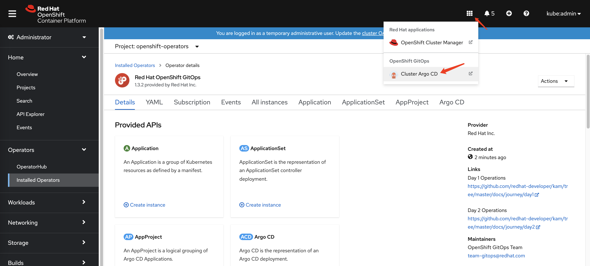

- GitOps UI will be poped up and you can login with `LOG IN VIA OPENSHIFT`.

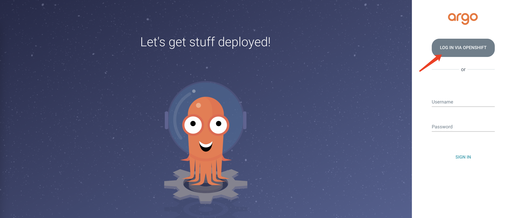

### Mirror Image to Local Registry with GitOps

#### Bastion host

Mirror Image to local Registry on Bastion host with GitOps

```
- GENERAL
  - Application Name: anyname(like "imagemirror")
  - Project: default
  - SYNC POLICY: Automatic
- SOURCE
  - REPO URL : https://github.com/IBM/cp4waiops-gitops
  - Target version: HEAD
  - path: config/3.2/airgap/imageMirror
- DESTINATION
  - Cluster URL: <cluster-url-in-basion-host>
  - Namespace: image
- HELM
  - spec.imageMirror_namespace: image
  - spec.localDockerRegistryHost: <localDockerRegistryHost>
  - spec.localDockerRegistryPort: <localDockerRegistryPort>
  - spec.localDockerRegistryUser: <localDockerRegistryUser>
  - spec.localDockerRegistryPassword: <localDockerRegistryPassword>
  - spec.cpRegistryPassword: <entitlement-key>
  - spec.aiManager.enabled: false  ## set to true if you want to install AIManager
  - spec.aiManager.caseName: ibm-cp-waiops
  - spec.aiManager.caseVersion: 1.1.0
  - spec.aiManager.redhatRegistryUser: <redhatRegistryUser>
  - spec.aiManager.redhatRegistryPassword: <redhatRegistryPassword>
  - spec.eventManager.enabled: ## set to true if you want to install EvetManger
  - spec.eventManager.caseName: ibm-netcool-prod
```

NOTE:

- `entitlement-key` is the entitlement key that you copied in [MyIBM Container Software Library](https://myibm.ibm.com/products-services/containerlibrary)

Connect your host to your air-gapped environment and connet your OCP to the gitops.


### Storage Consideration

Please refer to [Storage considerations](https://ibmdocs-test.mybluemix.net/docs/en/cloud-paks/cloud-pak-watson-aiops/3.2.0?topic=requirements-storage-considerations) for CP4WAIOSP 3.2.

In this tutorial, we are using Ceph, you can select different storage based on your system requirement.

From ArgoCD UI, click `NEW APP` and input parameters as follows for Ceph and then `Create`.

The parameters for Ceph are as follows:

```
- GENERAL
  - Application Name: ceph
  - Project: default
  - SYNC POLICY: Automatic
- SOURCE
  - REPO URL : https://github.com/IBM/cp4waiops-gitops
  - Target version: HEAD
  - path: ceph
- DESTINATION
  - Cluster URL: <ocp-cluster-url>
  - Namespace: rook-ceph
- DIRECTORY
  - DIRECTORY RECURSE: check it
```

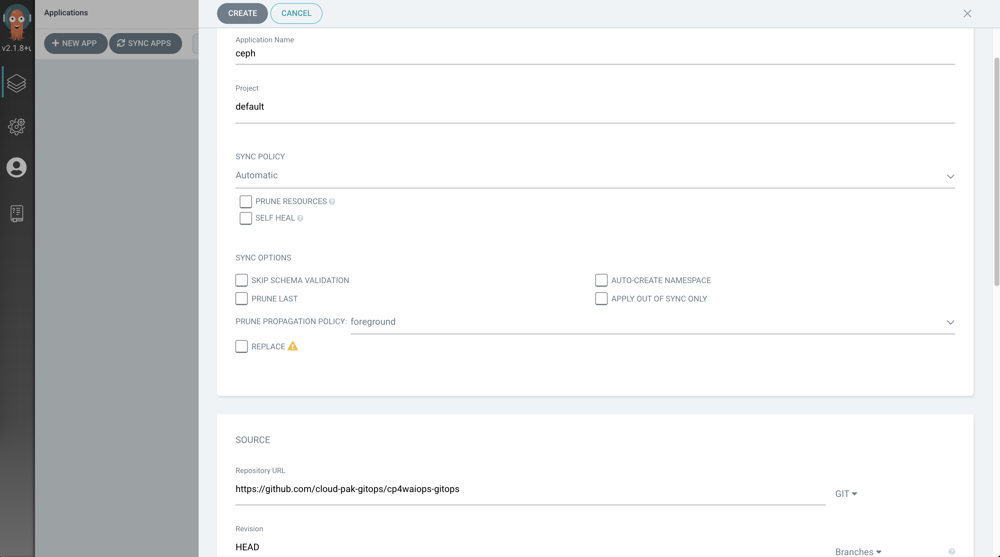

### Verify Ceph Cluster Installation

After Ceph ArgoCD App was created, you can click the App from ArgoCD UI, and you will see the toplogy of all Ceph resources as follows:

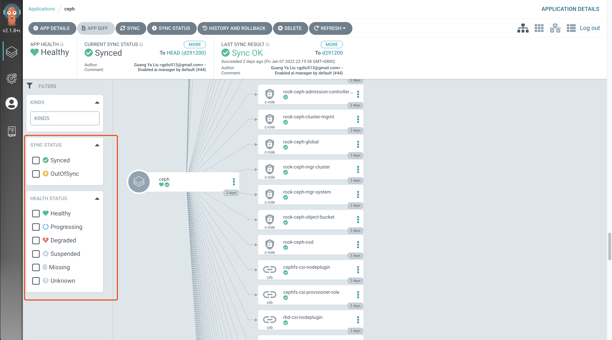

You can also use the filters on the left to filter out the resources that has been failed, and click the resource to check logs and events.

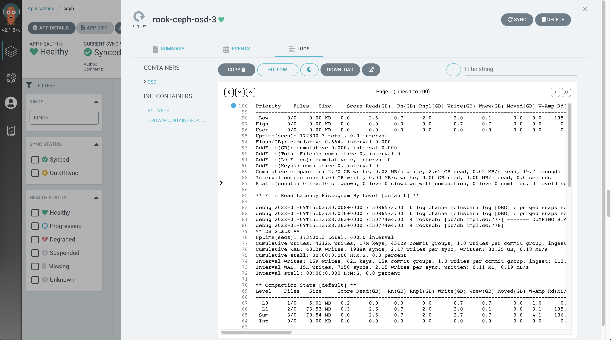

You can also check all Ceph Pods using CLI as follows, make sure there is no pod in error state.

If there are some pod got error, you can either check logs from ArgoCD UI or use CLI `oc logs` to check.

```console
[root@api.body.cp.fyre.ibm.com ~]# oc get po -n rook-ceph
NAME                                                              READY   STATUS      RESTARTS   AGE
csi-cephfsplugin-7b6jk                                            3/3     Running     0          2d
csi-cephfsplugin-l7mvz                                            3/3     Running     0          2d
csi-cephfsplugin-provisioner-695b574445-gfcwz                     6/6     Running     6          2d
csi-cephfsplugin-provisioner-695b574445-lb64p                     6/6     Running     7          2d
csi-cephfsplugin-qcsqz                                            3/3     Running     0          2d
csi-cephfsplugin-qdrtl                                            3/3     Running     0          2d
csi-cephfsplugin-wj7qq                                            3/3     Running     0          2d
csi-cephfsplugin-xlsnb                                            3/3     Running     0          2d
csi-rbdplugin-8xwdb                                               3/3     Running     0          2d
csi-rbdplugin-b6t9l                                               3/3     Running     0          2d
csi-rbdplugin-h965f                                               3/3     Running     0          2d
csi-rbdplugin-lv2hp                                               3/3     Running     0          2d
csi-rbdplugin-pqvrc                                               3/3     Running     0          2d
csi-rbdplugin-provisioner-7f9847cd48-48gqk                        6/6     Running     0          2d
csi-rbdplugin-provisioner-7f9847cd48-wxh2z                        6/6     Running     12         2d
csi-rbdplugin-x8cw9                                               3/3     Running     0          2d
rook-ceph-crashcollector-worker0.body.cp.fyre.ibm.com-88f5bnbdc   1/1     Running     0          2d
rook-ceph-crashcollector-worker1.body.cp.fyre.ibm.com-d4c7gdcts   1/1     Running     0          2d
rook-ceph-crashcollector-worker2.body.cp.fyre.ibm.com-7767p8fxm   1/1     Running     0          2d
rook-ceph-crashcollector-worker3.body.cp.fyre.ibm.com-6c5cqs4lk   1/1     Running     0          2d
rook-ceph-crashcollector-worker4.body.cp.fyre.ibm.com-787f99czf   1/1     Running     0          2d
rook-ceph-crashcollector-worker5.body.cp.fyre.ibm.com-94d4b654q   1/1     Running     0          2d
rook-ceph-mds-myfs-a-7d48d48497-sbhld                             1/1     Running     0          2d
rook-ceph-mds-myfs-b-66f4b746c7-2fnl2                             1/1     Running     0          2d
rook-ceph-mgr-a-5c84cd7b7b-574lf                                  1/1     Running     0          2d
rook-ceph-mon-a-7b947ddf45-74p49                                  1/1     Running     0          2d
rook-ceph-mon-b-7cf885c589-5j6r9                                  1/1     Running     0          2d
rook-ceph-mon-c-bcb6575d8-g9l5w                                   1/1     Running     0          2d
rook-ceph-operator-54649856c4-cdx24                               1/1     Running     0          2d
rook-ceph-osd-0-c44985597-gwkqk                                   1/1     Running     0          2d
rook-ceph-osd-1-6f7d5cc955-v4862                                  1/1     Running     0          2d
rook-ceph-osd-2-58df99c46f-5kl8z                                  1/1     Running     0          2d
rook-ceph-osd-3-5c8579456c-bpcqz                                  1/1     Running     0          2d
rook-ceph-osd-4-5668c69fbf-kvdf6                                  1/1     Running     0          2d
rook-ceph-osd-5-cbbdb95-cqvjd                                     1/1     Running     0          2d
rook-ceph-osd-prepare-worker0.body.cp.fyre.ibm.com-bxr7t          0/1     Completed   0          4h16m
rook-ceph-osd-prepare-worker1.body.cp.fyre.ibm.com-fftd8          0/1     Completed   0          4h16m
rook-ceph-osd-prepare-worker2.body.cp.fyre.ibm.com-scg84          0/1     Completed   0          4h16m
rook-ceph-osd-prepare-worker3.body.cp.fyre.ibm.com-m488b          0/1     Completed   0          4h16m
rook-ceph-osd-prepare-worker4.body.cp.fyre.ibm.com-dxcm5          0/1     Completed   0          4h16m
rook-ceph-osd-prepare-worker5.body.cp.fyre.ibm.com-jclnq          0/1     Completed   0          4h16m
```

### Install CP4WAIOPS using GitOps

Same as Ceph, you can follow same steps to install Cloud Pak for Watson AIOps using GitOps.

The parameters for Cloud Pak for Watson AIOps are as follows:

```
- GENERAL
  - Application Name: anyname(like "cp4waiops")
  - Project: default
  - SYNC POLICY: Automatic
- SOURCE
  - REPO URL : https://github.com/IBM/cp4waiops-gitops
  - Target version: HEAD
  - path: config/3.2/cp4waiops
- DESTINATION
  - Cluster URL: <ocp-cluster-url>
  - Namespace: cp4waiops
- HELM
  - spec.localDockerRegistryHost: <localDockerRegistryHost>
  - spec.localDockerRegistryPort: <localDockerRegistryPort>
  - spec.localDockerRegistryUser: <localDockerRegistryUser>
  - spec.localDockerRegistryPassword: <localDockerRegistryPassword>
  - spec.storageClass: rook-cephfs
  - spec.storageClassLargeBlock: rook-cephfs
  - spec.aiManager.enabled: true  ## set to true if you want to install AIManager
  - spec.aiManager.namespace: ibm-cp-waiops
  - spec.aiManager.caseName: ibm-cp-waiops
  - spec.aiManager.caseVersion: 1.1.0
  - spec.aiManager.channel: v3.2
  - spec.aiManager.size: small
  - spec.eventManager.enabled: false ## set to true if you want to install EvetManger
  - spec.eventManager.namespace: ibm-cp-waiops
  - spec.eventManager.version: 1.6.3.2
  - spec.eventManager.caseName: ibm-netcool-prod
  - spec.eventManager.clusterDomain: apps.clustername.*.*.com
  - spec.eventManager.channel: v1.5
  - spec.eventManager.deploymentType: trial
```

  NOTE: `spec.dockerPassword` is the entitlement key that you copied in [My IBM Container Software Library](https://myibm.ibm.com/products-services/containerlibrary).


### Verify CP4WAIOPS Installation

After both Ceph and Cloud Pak for Watson AIOps are ready, you will be able to see those two Apps from Argo CD UI as follows with status as `Healthy and Synced`.

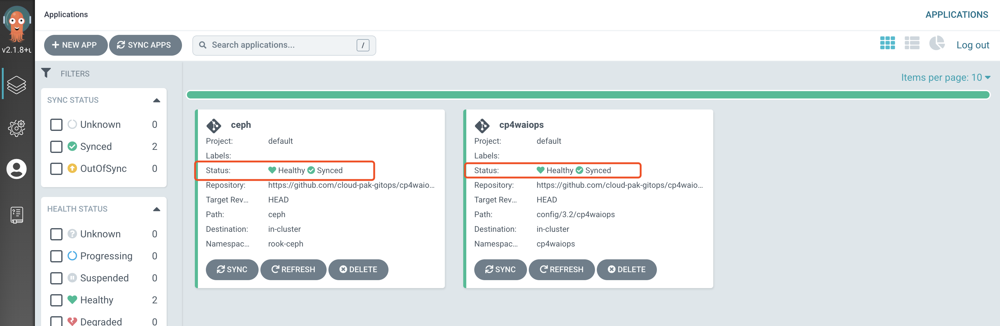

Same as Ceph, you can also check the topology of Cloud Pak for Watson AIOps using ArgoCD UI as follows:

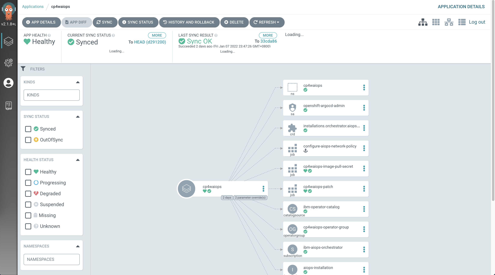

You can also check via termial as follows, and make sure there is no error pods.

If there are some pod got error, you can either check logs from ArgoCD UI or use CLI `oc logs` to check.

```console
[root@api.body.cp.fyre.ibm.com ~]# oc get po -n cp4waiops
NAME                                                              READY   STATUS      RESTARTS   AGE
aimanager-aio-ai-platform-api-server-7c877989d6-7jh55             1/1     Running     0          47h
aimanager-aio-change-risk-654884bd8c-6xpxw                        1/1     Running     0          47h
aimanager-aio-chatops-orchestrator-7c54fc5664-rtmrp               1/1     Running     0          47h
aimanager-aio-chatops-slack-integrator-77fc9499c4-wtclt           1/1     Running     0          47h
aimanager-aio-chatops-teams-integrator-577f6b85bf-j2995           1/1     Running     0          47h
aimanager-aio-controller-86875d4b7-jfwwp                          1/1     Running     0          47h
aimanager-aio-create-secrets-ccjdg                                0/1     Completed   0          47h
aimanager-aio-create-truststore-5hxps                             0/1     Completed   0          47h
aimanager-aio-curator-job-27362220-k59t8                          0/1     Completed   0          142m
aimanager-aio-curator-job-27362280-n2w88                          0/1     Completed   0          82m
aimanager-aio-curator-job-27362340-qkwln                          0/1     Completed   0          22m
aimanager-aio-log-anomaly-detector-fdfcbb96b-rpb9q                1/1     Running     0          47h
aimanager-aio-log-anomaly-detector-fdfcbb96b-v426m                1/1     Running     0          47h
aimanager-aio-similar-incidents-service-77cc9d699f-qlxgg          1/1     Running     0          47h
aimanager-ibm-minio-0                                             1/1     Running     0          47h
aimanager-operator-585d799f9f-w22vz                               1/1     Running     0          47h
aiops-ai-model-ui-674b4f77f9-qv56n                                1/1     Running     0          47h
aiops-akora-ui-7bc6d5dd6b-6n9rs                                   1/1     Running     0          47h
aiops-application-details-ui-66779f957b-fqfhk                     1/1     Running     0          47h
aiops-base-ui-5b9f885888-pvm7z                                    1/1     Running     0          47h
aiops-connections-ui-7996699c55-m79fl                             1/1     Running     0          47h
aiops-ir-analytics-classifier-75869fd78b-p2s9v                    1/1     Running     0          47h
aiops-ir-analytics-probablecause-6dd5ffd867-rrg6b                 1/1     Running     2          47h
aiops-ir-analytics-spark-master-5cd57946d4-99bqt                  1/1     Running     0          47h
aiops-ir-analytics-spark-pipeline-composer-795f965b6d-vkjqw       1/1     Running     0          47h
aiops-ir-analytics-spark-worker-65d57f7f9c-4nsb8                  1/1     Running     0          47h
aiops-ir-core-archiving-754dcb5fcb-jm82z                          1/1     Running     0          47h
aiops-ir-core-archiving-setup-rrlkh                               0/1     Completed   0          47h
aiops-ir-core-cem-users-65b9b699b9-hzh9b                          1/1     Running     0          47h
aiops-ir-core-esarchiving-67dbb7c5d7-wg7dx                        1/1     Running     0          47h
aiops-ir-core-logstash-6c89d66f79-tlfcl                           1/1     Running     0          47h
aiops-ir-core-ncobackup-0                                         2/2     Running     0          47h
aiops-ir-core-ncodl-api-59f977b475-lx7n4                          1/1     Running     0          47h
aiops-ir-core-ncodl-if-66cf44c565-lkkgx                           1/1     Running     0          47h
aiops-ir-core-ncodl-ir-7469fd4866-wjfvf                           1/1     Running     0          47h
aiops-ir-core-ncodl-jobmgr-76d74b5567-t77wc                       1/1     Running     0          47h
aiops-ir-core-ncodl-setup-8hx6c                                   0/1     Completed   0          47h
aiops-ir-core-ncodl-std-7677546c8d-dbqm9                          1/1     Running     0          47h
aiops-ir-core-ncodl-std-7677546c8d-wf82d                          1/1     Running     0          47h
aiops-ir-core-ncoprimary-0                                        1/1     Running     0          47h
aiops-ir-lifecycle-create-policies-job-dljxp                      0/1     Completed   0          47h
aiops-ir-lifecycle-eventprocessor-ep-jobmanager-0                 2/2     Running     0          47h
aiops-ir-lifecycle-eventprocessor-ep-taskmanager-0                1/1     Running     0          47h
aiops-ir-lifecycle-logstash-77579f5d7f-9rhsx                      1/1     Running     0          47h
aiops-ir-lifecycle-policy-grpc-svc-6b59698569-cvhvq               1/1     Running     0          47h
aiops-ir-lifecycle-policy-registry-svc-68647d4cdc-t27mw           1/1     Running     0          47h
aiops-ir-lifecycle-policy-registry-svc-job-8gk89                  0/1     Completed   3          47h
aiops-ir-ui-api-graphql-68488c7675-87mbp                          1/1     Running     0          47h
aiops-topology-cassandra-0                                        1/1     Running     0          47h
aiops-topology-cassandra-auth-secret-generator-7mm84              0/1     Completed   0          47h
aiops-topology-file-observer-5757769dd5-xxc8j                     1/1     Running     0          47h
aiops-topology-kubernetes-observer-d4c8bcb55-ddbcg                1/1     Running     0          47h
aiops-topology-layout-6b957b5bbb-m28rd                            1/1     Running     0          47h
aiops-topology-merge-76c494795f-5b65g                             1/1     Running     0          47h
aiops-topology-observer-service-6f5d6fb44b-jswwp                  1/1     Running     0          47h
aiops-topology-rest-observer-799bfdf4c8-5nt6n                     1/1     Running     0          47h
aiops-topology-search-6cd7cc9d8-64bdk                             1/1     Running     0          47h
aiops-topology-secret-manager-2b84s                               0/1     Completed   0          47h
aiops-topology-servicenow-observer-84c588df5b-gm6p2               1/1     Running     0          47h
aiops-topology-status-58ddcdc845-mqpzg                            1/1     Running     0          47h
aiops-topology-topology-577b988f78-kc2m6                          1/1     Running     2          47h
aiops-topology-ui-api-bbd74965d-gzlfd                             1/1     Running     0          47h
aiops-topology-vmvcenter-observer-86b6c8dc44-krvtj                1/1     Running     0          47h
aiopsedge-github-topology-integrator-7b9db59cd8-nbdgz             1/1     Running     0          47h
aiopsedge-operator-controller-manager-9b68ddd75-5rqqz             1/1     Running     1          47h
aiopsedge-operator-controller-manager-9b68ddd75-xj7tq             1/1     Running     1          47h
asm-operator-548c8894fd-r2dgv                                     1/1     Running     0          47h
c-example-couchdbcluster-m-0                                      3/3     Running     0          47h
c-example-redis-m-0                                               4/4     Running     0          47h
c-example-redis-m-1                                               4/4     Running     0          47h
c-example-redis-m-2                                               4/4     Running     0          47h
c-example-redis-s-0                                               4/4     Running     0          47h
c-example-redis-s-1                                               4/4     Running     0          47h
c-example-redis-s-2                                               4/4     Running     0          47h
camel-k-kit-c7c60rolvegv49tvh8fg-1-build                          0/1     Completed   0          47h
camel-k-kit-c7c60sglvegv49tvh8g0-1-build                          0/1     Completed   0          47h
camel-k-kit-c7c60tglvegv49tvh8gg-1-build                          0/1     Completed   0          47h
camel-k-kit-c7c60tolvegv49tvh8h0-1-build                          0/1     Completed   0          47h
camel-k-operator-684f46fc4d-s6hf2                                 1/1     Running     0          47h
configure-aiops-network-policy-967ll                              0/1     Completed   0          47h
connector-controller-bc7fc6668-f8nn5                              1/1     Running     0          47h
connector-synchronizer-7d4546ddd4-5kbrl                           1/1     Running     0          47h
couchdb-operator-d5cb7ff8c-rjnhx                                  1/1     Running     0          47h
cp4waiops-eventprocessor-eve-29ee-ep-jobmanager-0                 2/2     Running     0          47h
cp4waiops-eventprocessor-eve-29ee-ep-jobmanager-1                 2/2     Running     0          47h
cp4waiops-eventprocessor-eve-29ee-ep-taskmanager-0                1/1     Running     1          47h
cp4waiops-eventprocessor-eve-29ee-ep-taskmanager-1                1/1     Running     0          47h
cp4waiops-image-pull-secret-6fprf                                 0/1     Completed   0          2d
cp4waiops-patch-j4qrm                                             0/1     Completed   0          2d
cp4waiops-postgres-keeper-0                                       1/1     Running     0          47h
cp4waiops-postgres-postgresql-create-cluster-7xb6t                0/1     Completed   0          47h
cp4waiops-postgres-proxy-648bc64fd-x4mvv                          1/1     Running     0          47h
cp4waiops-postgres-sentinel-5878f67f46-gvv7l                      1/1     Running     0          47h
cp4waiops-postgresdb-postgresql-create-database-9j6kq             0/1     Completed   0          47h
create-secrets-job-nx6dg                                          0/1     Completed   0          47h
gateway-kong-5d45b77fb4-tgjcv                                     2/2     Running     2          47h
gateway-kong-config-svc-27362360-9dmzc                            0/1     Completed   0          2m51s
iaf-core-operator-controller-manager-58dfd97f5c-bdd9t             1/1     Running     0          2d
iaf-eventprocessing-operator-controller-manager-5bc597797f6fxm4   1/1     Running     1          2d
iaf-flink-operator-controller-manager-7dc56c9b68-6rgtk            1/1     Running     0          2d
iaf-operator-controller-manager-6bc8f44ff7-rrrnx                  1/1     Running     0          2d
iaf-system-elasticsearch-es-aiops-0                               2/2     Running     0          47h
iaf-system-entity-operator-6b5444f575-7tdfw                       3/3     Running     0          47h
iaf-system-kafka-0                                                1/1     Running     0          47h
iaf-system-zookeeper-0                                            1/1     Running     0          47h
iaf-zen-tour-job-fhdfr                                            0/1     Completed   0          47h
iam-config-job-tfsst                                              0/1     Completed   0          47h
ibm-aiops-orchestrator-6c7cfc85b7-wqdnr                           1/1     Running     0          2d
ibm-cloud-databases-redis-operator-854cf65c4f-4rrvn               1/1     Running     0          47h
ibm-common-service-operator-5cd6947dc8-z8plb                      1/1     Running     0          2d
ibm-elastic-operator-controller-manager-5d6c467b55-wtrvg          1/1     Running     0          2d
ibm-ir-ai-operator-controller-manager-59b88c6bf6-ncnbt            1/1     Running     7          47h
ibm-kong-operator-6ff97bcdb9-rl7cp                                1/1     Running     0          47h
ibm-nginx-cd84b4d8-7ttn2                                          1/1     Running     0          47h
ibm-nginx-cd84b4d8-zp4t2                                          1/1     Running     0          47h
ibm-postgreservice-operator-controller-manager-8b7bdf589-hbg2g    1/1     Running     2          47h
ibm-secure-tunnel-operator-657dd7b78f-tsgws                       1/1     Running     0          47h
ibm-vault-deploy-consul-0                                         1/1     Running     0          47h
ibm-vault-deploy-vault-0                                          1/1     Running     0          47h
ibm-vault-deploy-vault-cron-job-27361440-qxpjl                    0/1     Completed   0          15h
ibm-vault-deploy-vault-injector-596567d459-wzkws                  1/1     Running     0          47h
ibm-vault-operator-controller-manager-5957bb5ff9-4zdrb            1/1     Running     0          47h
ibm-watson-aiops-ui-operator-controller-manager-b8cf6fff7-msspt   1/1     Running     0          47h
ir-core-operator-controller-manager-76dbdb699d-g97ng              1/1     Running     7          47h
ir-lifecycle-operator-controller-manager-64bdd8f7b6-pn46g         1/1     Running     9          47h
model-train-classic-operator-56d487585c-4dv5b                     1/1     Running     2          47h
modeltrain-ibm-modeltrain-lcm-865b7f85cc-jfq4z                    1/1     Running     0          47h
modeltrain-ibm-modeltrain-ratelimiter-595f4f478-r9dwp             1/1     Running     0          47h
modeltrain-ibm-modeltrain-trainer-5b7f7888b5-c8cz5                1/1     Running     0          47h
post-aiops-resources-t4ww9                                        0/1     Completed   0          47h
post-aiops-translations-t58bb                                     0/1     Completed   0          47h
post-aiops-update-user-role-kcr8k                                 0/1     Completed   0          47h
scm-handlers-d655679fc-lvls2                                      2/2     Running     0          47h
setup-nginx-job-tn8sc                                             0/1     Completed   0          47h
snow-handlers-d8488f6f8-8lhxh                                     2/2     Running     0          47h
sre-tunnel-controller-84565ff4f8-4qtwl                            1/1     Running     0          47h
sre-tunnel-tunnel-network-api-589fd6646d-7znnh                    1/1     Running     0          47h
sre-tunnel-tunnel-ui-mcmtunnelui-fff9b859b-g7dlk                  1/1     Running     0          47h
usermgmt-5fb7986c7b-dwmk2                                         1/1     Running     0          47h
usermgmt-5fb7986c7b-ssk86                                         1/1     Running     0          47h
zen-audit-678b54b548-n7q7f                                        1/1     Running     0          47h
zen-core-64c6d56db-d25zm                                          1/1     Running     0          47h
zen-core-64c6d56db-glv65                                          1/1     Running     1          47h
zen-core-api-85489478d6-95pck                                     1/1     Running     0          47h
zen-core-api-85489478d6-n9x5s                                     1/1     Running     0          47h
zen-metastoredb-0                                                 1/1     Running     0          47h
zen-metastoredb-1                                                 1/1     Running     0          47h
zen-metastoredb-2                                                 1/1     Running     0          47h
zen-metastoredb-certs-lblhv                                       0/1     Completed   0          47h
zen-metastoredb-init-hvlv2                                        0/1     Completed   0          47h
zen-post-requisite-job-lpkfw                                      0/1     Completed   0          47h
zen-pre-requisite-job-2klrt                                       0/1     Completed   0          47h
zen-watcher-d8b795b46-2q6zx                                       1/1     Running     0          47h
```

### Access Cloud Pak for Watson AIOps

If all pods are running for Cloud Pak for Watson AIOps, you can login to Cloud Pak for Watson AIOps UI as follows:

- Login to OCP UI, click the `Red Hat Applications icon` on top right.

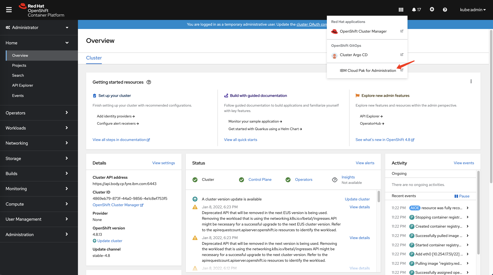

- Click the link for the `Cloud Pak for Administration`. Log in via `OpenShift authentication`.

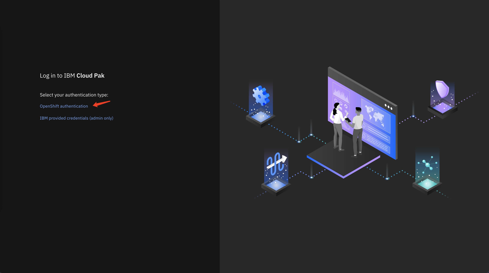

- Login to `Cloud Pak for Administration` and click the top right, select `IBM Automation (cp4waiops)`.

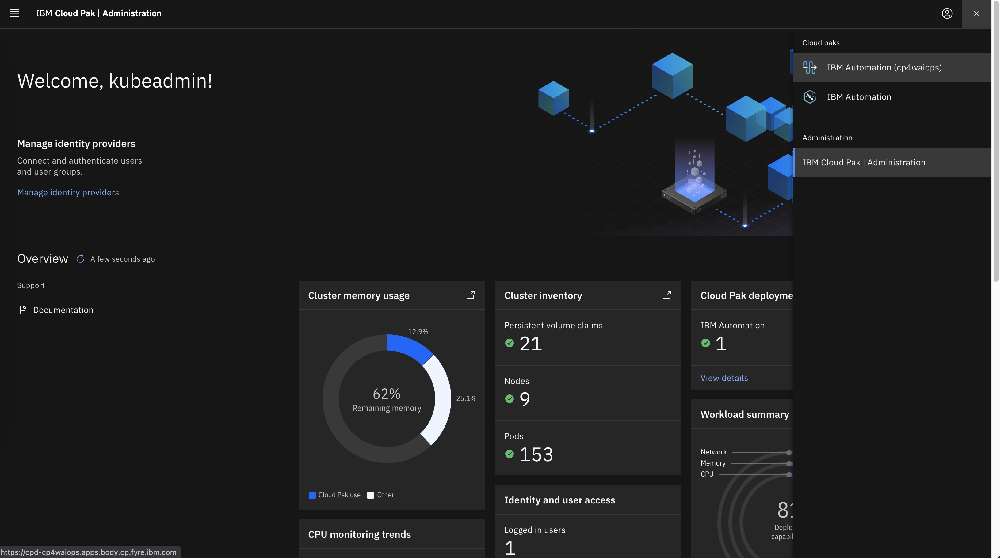

- Log in via `OpenShift authentication` to Cloud Pak for Watson AIOps UI.

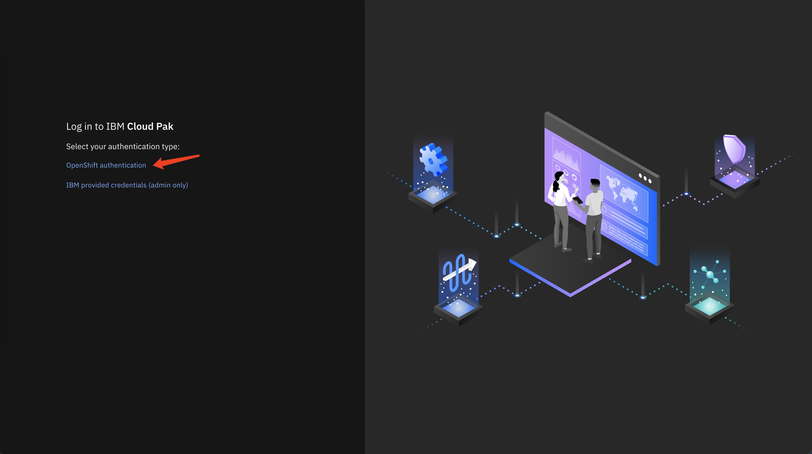

- You will be navigated to Cloud Pak for Watson AIOps UI!

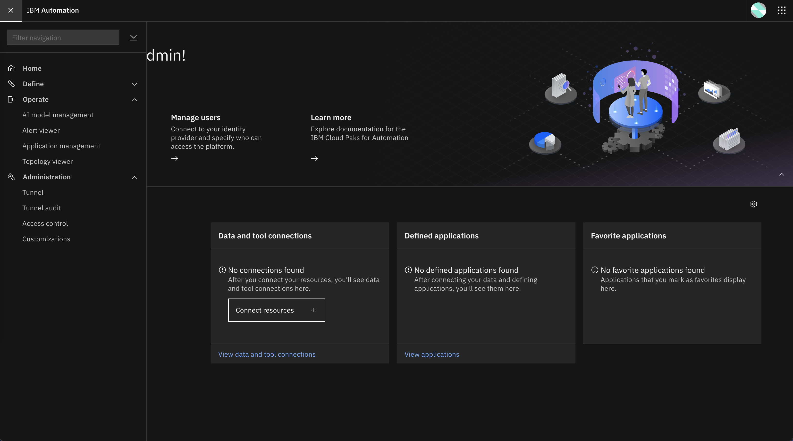

- Congratulations! You are ready to play with Cloud Pak for Watson AIOps!

## Using CLI to Install CP4WAIOPS

### Grant ArgoCD Cluster Admin Permission

```yaml
kind: ClusterRoleBinding
apiVersion: rbac.authorization.k8s.io/v1
metadata:
  name: argocd-admin
subjects:
  - kind: ServiceAccount
    name: openshift-gitops-argocd-application-controller
    namespace: openshift-gitops
roleRef:
  apiGroup: rbac.authorization.k8s.io
  kind: ClusterRole
  name: cluster-admin
```

### Login to the ArgoCD server

   ```sh
   # OCP 4.8
   argo_route=openshift-gitops-server
   argo_secret=openshift-gitops-cluster
   sa_account=openshift-gitops-argocd-application-controller

   argo_pwd=$(oc get secret ${argo_secret} \
               -n openshift-gitops \
               -o jsonpath='{.data.admin\.password}' | base64 -d ; echo ) \
   && argo_url=$(oc get route ${argo_route} \
                  -n openshift-gitops \
                  -o jsonpath='{.spec.host}') \
   && argocd login "${argo_url}" \
         --username admin \
         --password "${argo_pwd}" \
         --insecure
   ```

### Mirror Image to Local Registry with GitOps

```sh
argocd app create cp4waiops \
      --sync-policy automatic \
      --project default \
      --repo https://github.com/IBM/cp4waiops-gitops.git \
      --path config/3.2/airgap/imageMirror \
      --revision HEAD \
      --dest-namespace image \
      --dest-server https://kubernetes.default.svc \
      --helm-set spec.imageMirror_namespace=image \
      --helm-set spec.localDockerRegistryHost=<localDockerRegistryHost> \
      --helm-set spec.localDockerRegistryPort=<localDockerRegistryPort> \
      --helm-set spec.localDockerRegistryUser=<localDockerRegistryUser> \
      --helm-set spec.localDockerRegistryPassword=<localDockerRegistryPassword> \
      --helm-set spec.cpRegistryPassword=<entitlement-key> \
      --helm-set spec.aiManager.enabled=false \
      --helm-set spec.aiManager.caseName=ibm-cp-waiops \
      --helm-set spec.aiManager.caseVersion=1.1.0 \
      --helm-set spec.aiManager.redhatRegistryUser=<redhatRegistryUser> \
      --helm-set spec.aiManager.redhatRegistryPassword=<redhatRegistryPassword> \
      --helm-set spec.eventManager.enabled=false \
      --helm-set spec.eventManager.caseName=ibm-netcool-prod
```

NOTE:

- `entitlement-key` is the entitlement key that you copied in [MyIBM Container Software Library](https://myibm.ibm.com/products-services/containerlibrary)

Connect your host to your air-gapped environment and connet your OCP to the gitops.

### Storage Consideration

Please refer to [Storage considerations](https://ibmdocs-test.mybluemix.net/docs/en/cloud-paks/cloud-pak-watson-aiops/3.2.0?topic=requirements-storage-considerations) for CP4WAIOSP 3.2.

In this tutorial, we are using Ceph, you can select different storage based on your system requirement.

```sh
argocd app create ceph \
      --sync-policy automatic \
      --project default \
      --repo https://github.com/IBM/cp4waiops-gitops.git \
      --path ceph \
      --revision HEAD \
      --dest-namespace rook-ceph \
      --dest-server https://kubernetes.default.svc \
      --directory-recurse
```

### Install CP4WAIOPS using GitOps

```sh
argocd app create cp4waiops \
      --sync-policy automatic \
      --project default \
      --repo https://github.com/IBM/cp4waiops-gitops.git \
      --path config/3.2/cp4waiops \
      --revision HEAD \
      --dest-namespace cp4waiops \
      --dest-server <your airgap OCP cluster> \
      --helm-set spec.localDockerRegistryHost=<localDockerRegistryHost> \
      --helm-set spec.localDockerRegistryPort=<localDockerRegistryPort> \
      --helm-set spec.localDockerRegistryUser=<localDockerRegistryUser> \
      --helm-set spec.localDockerRegistryPassword=<localDockerRegistryPassword> \
      --helm-set spec.storageClass=rook-cephfs \
      --helm-set spec.storageClassLargeBlock=rook-cephfs \
      --helm-set spec.aiManager.enabled=true \
      --helm-set spec.aiManager.namespace=cp4waiops \
      --helm-set spec.aiManager.caseName=ibm-cp-waiops \
      --helm-set spec.aiManager.caseVersion=1.1.0 \
      --helm-set spec.aiManager.channel=<redhatRegistryUser> \
      --helm-set spec.aiManager.size=<redhatRegistryPassword> \
      --helm-set spec.eventManager.enabled=false \
      --helm-set spec.eventManager.namespace=eventmanager \
      --helm-set spec.eventManager.caseName=ibm-netcool-prod \
      --helm-set spec.eventManager.version=1.6.3.2 \
      --helm-set spec.eventManager.clusterDomain=apps.clustername.*.*.com \
      --helm-set spec.eventManager.channel=v1.5 \
      --helm-set spec.eventManager.deploymentType=trial
```

NOTE:

- `entitlement-key` is the entitlement key that you copied in [MyIBM Container Software Library](https://myibm.ibm.com/products-services/containerlibrary)

- `apps.clustername.*.*.com` is the domain name of your OCP cluster

### Verify CP4WAIOPS Installation

You can run the command as follows to check:

```
kubectl get application -A
```

In this tutorial, the output of the above command is as follows:

```console
# kubectl get application -A
NAMESPACE          NAME           SYNC STATUS   HEALTH STATUS
openshift-gitops   ceph           Synced        Healthy
openshift-gitops   cp4waiops      Synced        Healthy
openshift-gitops   mirror-image   Synced        Healthy
```

Wait a while and check if all pods under namespace `cp4waiops` and are running well without any crash.

```
kubectl get pod -n cp4waiops
```
### Access CP4WAIOps UI

Refer to [Access Cloud Pak for Watson AIOps](#access-cloud-pak-for-watson-aiops) and play with Cloud Pak for Watson AIOps.
