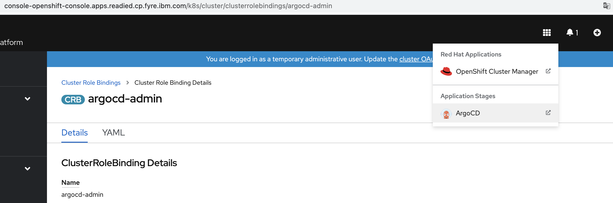
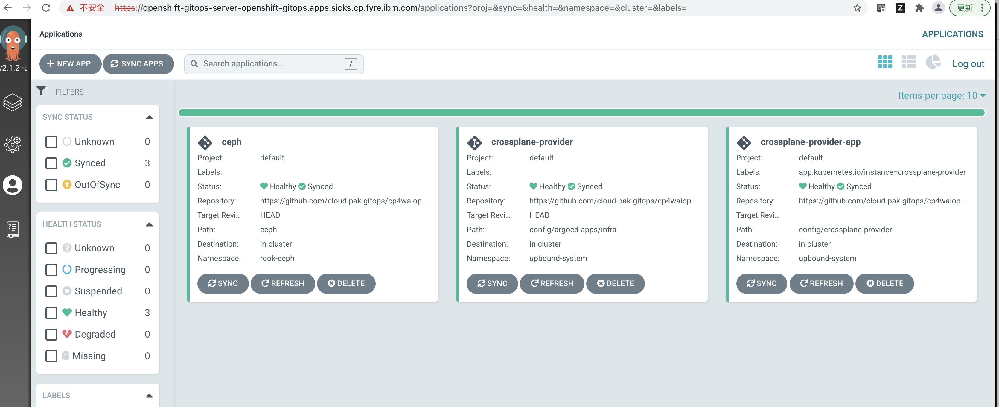
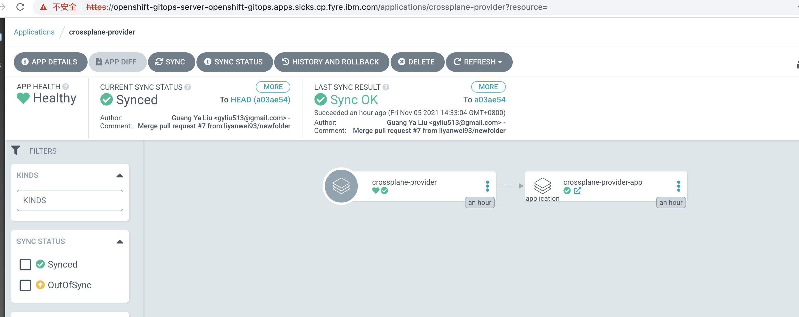
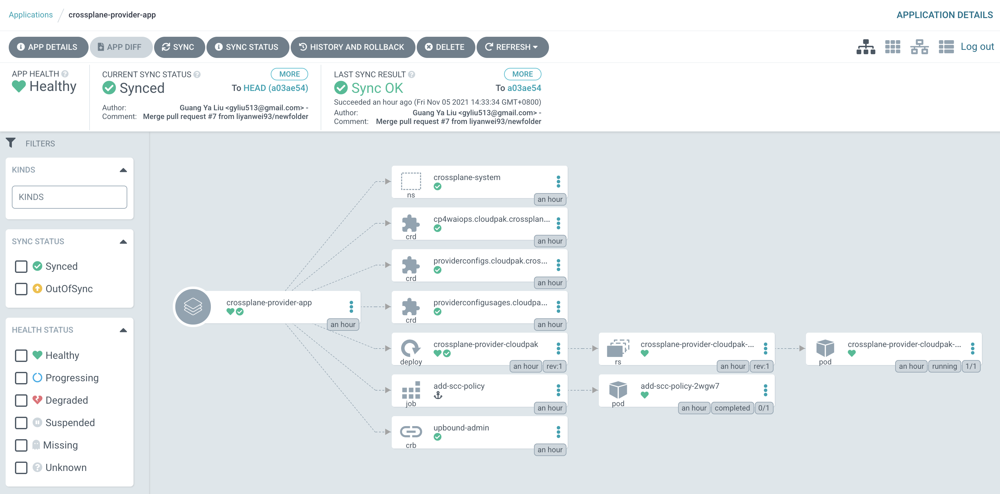
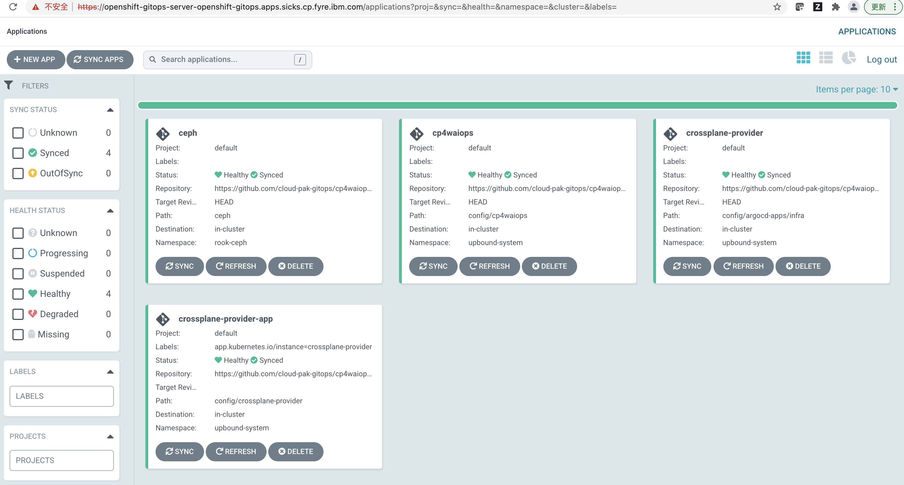
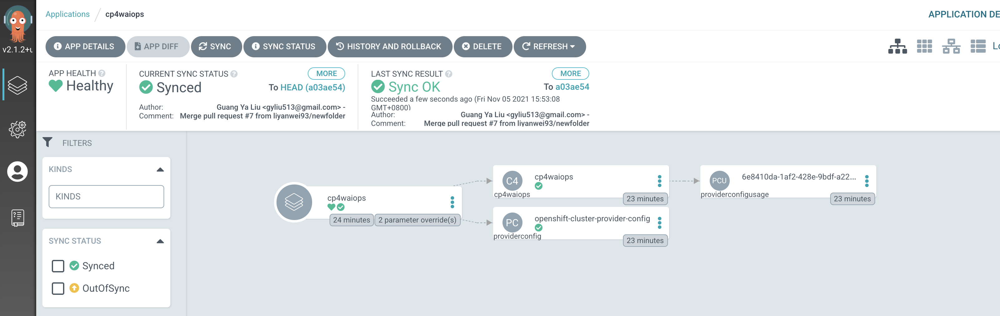
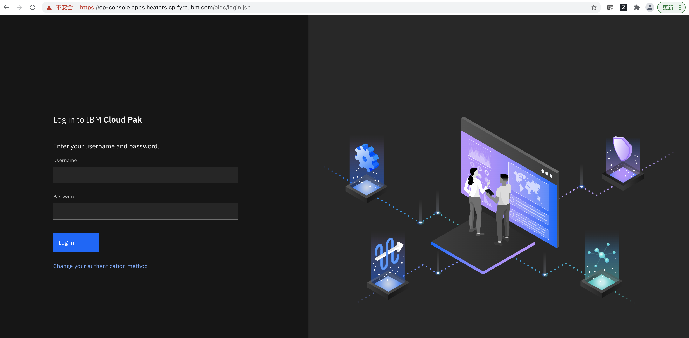
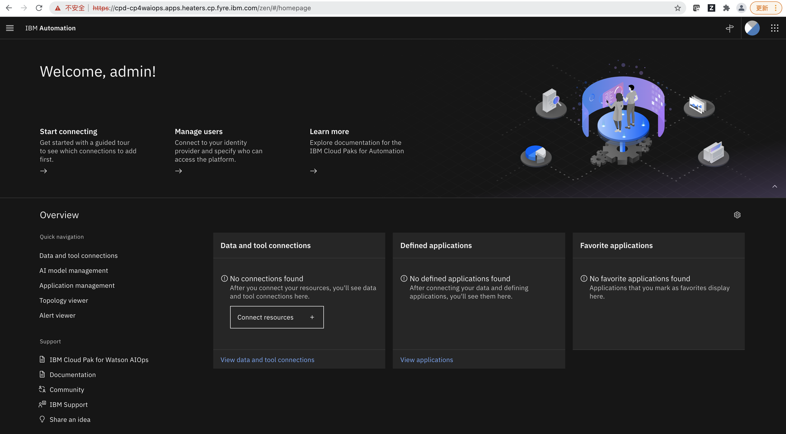

<!-- START doctoc generated TOC please keep comment here to allow auto update -->
<!-- DON'T EDIT THIS SECTION, INSTEAD RE-RUN doctoc TO UPDATE -->
**Table of Contents**  *generated with [DocToc](https://github.com/thlorenz/doctoc)*

- [Deploy Cloud Pak for Watson AIOps with OpenShift GitOps](#deploy-cloud-pak-for-watson-aiops-with-openshift-gitops)
  - [Prerequisite](#prerequisite)
  - [Install Infra (Crossplane CP4WAIOPS Provider)](#install-infra-crossplane-cp4waiops-provider)
    - [Grant Argo CD Enough Permissions](#grant-argo-cd-enough-permissions)
    - [Login to Argo CD](#login-to-argo-cd)
    - [Install CP4WAIOPS Provider](#install-cp4waiops-provider)
    - [Verify Crossplane Provider](#verify-crossplane-provider)
      - [CLI Verify](#cli-verify)
      - [UI Verify](#ui-verify)
  - [Storage Consideration](#storage-consideration)
  - [Deploy Cloud Paks](#deploy-cloud-paks)
    - [Create a secret storing your entitlement key:](#create-a-secret-storing-your-entitlement-key)
    - [Create a secret storing target ocp cluster kubeconfig :](#create-a-secret-storing-target-ocp-cluster-kubeconfig-)
    - [Create a ArgoCD application for installing cp4waiops in-cluster](#create-a-argocd-application-for-installing-cp4waiops-in-cluster)
    - [Verify Cloud Paks Installation](#verify-cloud-paks-installation)
      - [CLI Verify](#cli-verify-1)
      - [UI Verify](#ui-verify-1)
    - [Access CP4WAIOps UI](#access-cp4waiops-ui)

<!-- END doctoc generated TOC please keep comment here to allow auto update -->

# Deploy Cloud Pak for Watson AIOps with OpenShift GitOps

## Prerequisite

- OCP 4.6 + 
- Install gitops operator(Red Hat OpenShift GitOps) in ocp operator-hub
- Install crossplane operator(Upbound Universal Crossplane (UXP)) in ocp operator-hub

## Install Infra (Crossplane CP4WAIOPS Provider)

### Grant Argo CD Enough Permissions

```yaml
kind: ClusterRoleBinding
apiVersion: rbac.authorization.k8s.io/v1
metadata:
  name: argocd-admin
subjects:
  - kind: ServiceAccount
    name: openshift-gitops-argocd-application-controller
    namespace: openshift-gitops
roleRef:
  apiGroup: rbac.authorization.k8s.io
  kind: ClusterRole
  name: cluster-admin
```

### Login to Argo CD

Login ArgoCD entrance

   

Login Username/Password
```
Username: admin  
Password: Please copy the Data value of secret "openshift-gitops-cluster" in namespace "openshift-gitops"
```

 

### Install CP4WAIOPS Provider

Create application.  
Choose "New App" in "Applications".  
Fill in like below, then choose "create". 

```
GENERAL
Application Name: anyname(like "crossplane-provider")
Project: default
SYNC POLICY: Automatic

SOURCE
REPO URL : https://github.com/IBM/cp4waiops-gitops
Target version: HEAD
path: config/3.1/argocd-apps/infra

DESTINATION
Cluster URL: https://kubernetes.default.svc
Namespace: upbound-system

HELM
metadata.argocd_app_namespace: openshift-gitops
metadata.cp4waiops_provider_namespace: upbound-system
metadata.crossplane_namespace: upbound-system
repoURL: https://github.com/IBM/cp4waiops-gitops
```

### Verify Crossplane Provider

#### CLI Verify

After cp4waiops provider was deployed, you can run the command as follows to check:

```
kubectl get po -n upbound-system
kubectl get application -A
```

In this tutorial, the output of the above command is as follows:

```console
# kubectl get po -n upbound-system
NAME                                            READY   STATUS      RESTARTS   AGE
add-scc-policy-2wgw7                            0/1     Completed   0          98m
crossplane-5d88f96479-jdnf2                     1/1     Running     2          4h14m
crossplane-provider-cloudpak-57cf9bb7c8-5l852   1/1     Running     0          98m
crossplane-rbac-manager-58c6656768-4cgr5        1/1     Running     2          4h14m
upbound-bootstrapper-67d458bf85-kkgq9           1/1     Running     0          4h14m
xgql-7b65998b88-p6shn                           1/1     Running     2          4h14m
```
```console
# kubectl get application -A
NAMESPACE          NAME                      SYNC STATUS   HEALTH STATUS
openshift-gitops   ceph                      Synced        Healthy
openshift-gitops   crossplane-provider       Synced        Healthy
openshift-gitops   crossplane-provider-app   Synced        Healthy
```

#### UI Verify

From Argo CD UI, you will be able to see there are two applications as follows:

- There are two applications, one is `crossplane-provider` and another is `crossplane-provider-app`. The `crossplane-provider` bring up the `crossplane-provider-app` via the [app-of-apps pattern](https://argo-cd.readthedocs.io/en/stable/operator-manual/cluster-bootstrapping/#app-of-apps-pattern).



- This is the deatail of app `crossplane-provider`, and the following picture describes the [app-of-apps pattern](https://argo-cd.readthedocs.io/en/stable/operator-manual/cluster-bootstrapping/#app-of-apps-pattern).



- The following picture is the detail of the `crossplane-provider-app`, you can see all of the resources for this app.



## Storage Consideration

It depends where the OCP comes from , if you're using fyre , then could create gitops application

```
GENERAL
Application Name: ceph
Project: default
SYNC POLICY: Automatic

SOURCE
REPO URL : https://github.com/IBM/cp4waiops-gitops
Target version: HEAD
path: ceph

DESTINATION
Cluster URL: https://kubernetes.default.svc
Namespace: rook-ceph
DIRECTORY
DIRECTORY RECURSE: tick it
```

## Deploy Cloud Paks

### Create a secret storing your entitlement key:

```
kubectl create secret generic image-pull-secret --from-literal=cp.icr.io=cp:<entitlement-key> -n crossplane-system
```

**Note:** refer to [CP4WAIOPS-KC](https://www.ibm.com/docs/en/cloud-paks/cp-waiops/3.1.0?topic=installing-preparing-install-cloud-pak#entitlement_keys) to replace the `entitlement-key` 

### Create a secret storing target ocp cluster kubeconfig :

```
kubectl create secret generic openshift-cluster-kubeconfig --from-file=credentials=<kubeconfig> -n crossplane-system
```

**Note:** please replace the kubeconfig to your real file , default value : /root/.kube/config


### Create a ArgoCD application for installing cp4waiops in-cluster

```
GENERAL
Application Name: anyname(like "cp4waiops")
Project: default
SYNC POLICY: Automatic

SOURCE
REPO URL : https://github.com/IBM/cp4waiops-gitops
Target version: HEAD
path: config/3.1/cp4waiops

DESTINATION
Cluster URL: https://kubernetes.default.svc
Namespace: upbound-system

HELM
spec.cp4waiops_namespace: cp4waiops
spec.channel: v3.1
spec.imageCatalog: icr.io/cpopen/aiops-orchestrator-catalog:3.1-latest
spec.imagePullSecret: ibm-entitlement-key
spec.kubeConfigSecretName: openshift-cluster-kubeconfig
spec.kubeConfigSecretNS: crossplane-system
spec.providerConfigRef: openshift-cluster-provider-config 
spec.storageClass: rook-cephfs
spec.storageClassLargeBlock: rook-cephfs
```

### Verify Cloud Paks Installation

#### CLI Verify

After instana instance was deployed, you can run the command as follows to check:

```
kubectl get application -A
```

In this tutorial, the output of the above command is as follows:

```console
# kubectl get application -A
NAMESPACE          NAME                      SYNC STATUS   HEALTH STATUS
openshift-gitops   ceph                      Synced        Healthy
openshift-gitops   cp4waiops                 Synced        Healthy
openshift-gitops   crossplane-provider       Synced        Healthy
openshift-gitops   crossplane-provider-app   Synced        Healthy
```

Wait a while and check if all pods under namespace `cp4waiops` and are running well without any crash.

```
kubectl get pod -n cp4waiops
```

#### UI Verify

From Argo CD UI, you will be able to see there are another application added as follows:



- The following picture is the detail of the `cp4waiops`, you can see all of the resources for this app.


### Access CP4WAIOps UI

After you successfully install IBM Cloud Pak for Watson AIOps, check [CP4WAIOPS-KC](https://www.ibm.com/docs/en/cloud-paks/cloud-pak-watson-aiops/3.2.0?topic=installation-installing-online-offline#console) to get the URL for accessing the IBM Cloud Pak for Watson AIOps console, username and password.



After click `Log In`, you will be navigated to the CP4WAIOps UI as follows.

