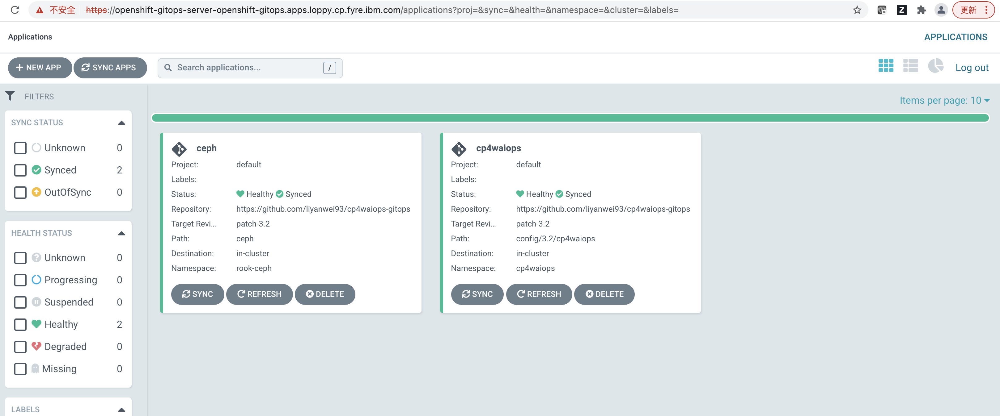
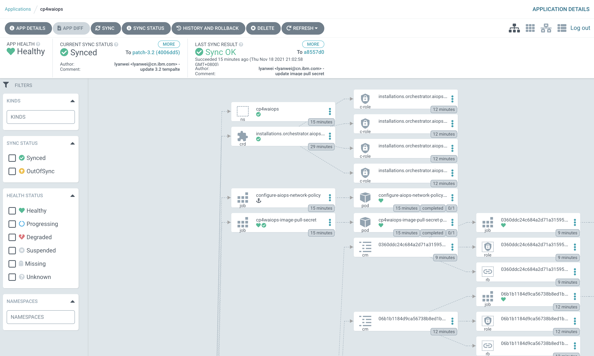
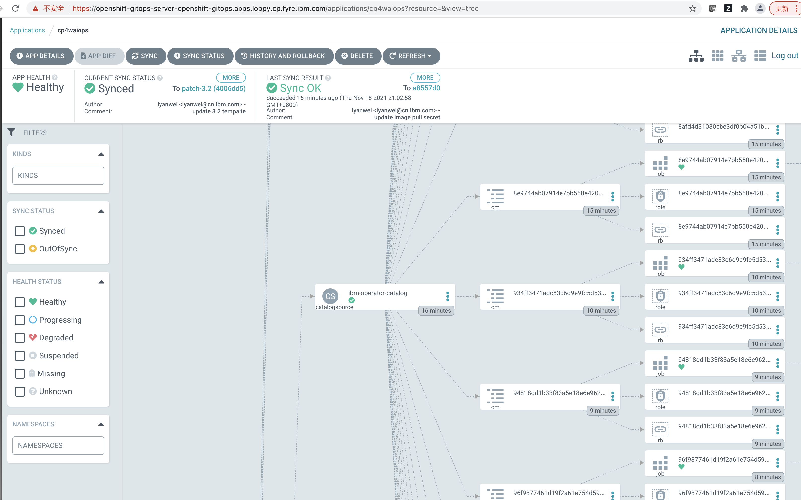
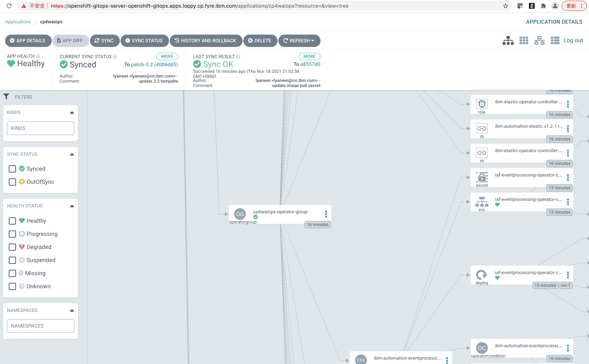
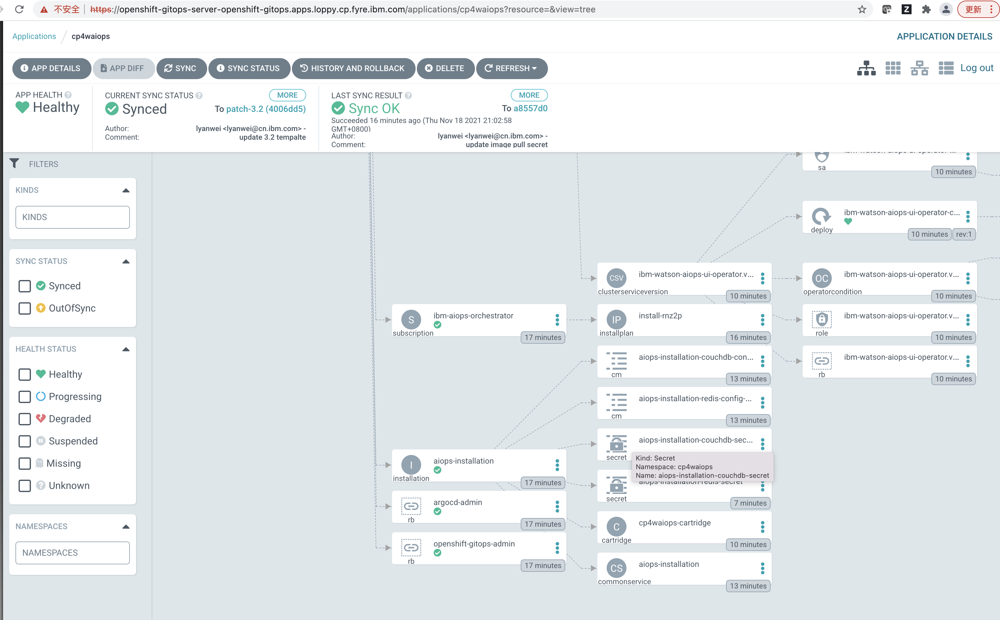

<!-- START doctoc generated TOC please keep comment here to allow auto update -->
<!-- DON'T EDIT THIS SECTION, INSTEAD RE-RUN doctoc TO UPDATE -->
**Table of Contents**  *generated with [DocToc](https://github.com/thlorenz/doctoc)*

- [Deploy Cloud Pak for Watson AIOps with OpenShift GitOps](#deploy-cloud-pak-for-watson-aiops-with-openshift-gitops)
  - [Prerequisite](#prerequisite)
  - [Install CP4WAIOPS](#install-cp4waiops)
    - [Option 1: Using the OCP console](#option-1-using-the-ocp-console)
      - [1. Grant Argo CD Enough Permissions](#1-grant-argo-cd-enough-permissions)
      - [2. Login to Argo CD](#2-login-to-argo-cd)
      - [3. Storage Consideration](#3-storage-consideration)
      - [4. Create a ArgoCD application for installing cp4waiops in-cluster](#4-create-a-argocd-application-for-installing-cp4waiops-in-cluster)
    - [Option 2: Using a terminal](#option-2-using-a-terminal)
      - [1. Grant Argo CD Enough Permissions](#1-grant-argo-cd-enough-permissions-1)
      - [2. Login to the Argo CD server](#2-login-to-the-argo-cd-server)
      - [3. Storage Consideration](#3-storage-consideration-1)
      - [4. Create a ArgoCD application for installing cp4waiops in-cluster](#4-create-a-argocd-application-for-installing-cp4waiops-in-cluster-1)
    - [Verify Cloud Paks Installation](#verify-cloud-paks-installation)
      - [CLI Verify](#cli-verify)
      - [UI Verify](#ui-verify)
    - [Access CP4WAIOps UI](#access-cp4waiops-ui)

<!-- END doctoc generated TOC please keep comment here to allow auto update -->

# Deploy Cloud Pak for Watson AIOps with OpenShift GitOps

## Prerequisite

- OCP 4.6 + 
- Install gitops operator(Red Hat OpenShift GitOps) in ocp operator-hub

## Install CP4WAIOPS

### Option 1: Using the OCP console

#### 1. Grant Argo CD Enough Permissions

From the Red Hat OpenShift OLM UI, go to **User Management** > **RoleBindings** > **Create binding**.

Use the Form view to configure the properties for the **ClusterRoleBinding**, and select the Create button.

```
Binding type: Cluster-wide role binding (ClusterRoleBinding)

RoleBinding
Name: argocd-admin

Role
Role Name: cluster-name

Subject
ServiceAccount:  tick it
Subject namespace: openshift-gitops
Subject name: openshift-gitops-argocd-application-controller
```

#### 2. Login to Argo CD

Login ArgoCD entrance

   

Login Username/Password
```
Username: admin  
Password: Please copy the Data value of secret "openshift-gitops-cluster" in namespace "openshift-gitops"
```

 

#### 3. Storage Consideration

It depends where the OCP comes from , if you're using fyre , then could create gitops application

```
GENERAL
Application Name: ceph
Project: default
SYNC POLICY: Automatic

SOURCE
REPO URL : https://github.com/cloud-pak-gitops/cp4waiops-gitops
Target version: HEAD
path: ceph

DESTINATION
Cluster URL: https://kubernetes.default.svc
Namespace: rook-ceph
DIRECTORY
DIRECTORY RECURSE: tick it
```

#### 4. Create a ArgoCD application for installing cp4waiops in-cluster

```
GENERAL
Application Name: anyname(like "cp4waiops")
Project: default
SYNC POLICY: Automatic

SOURCE
REPO URL : https://github.com/cloud-pak-gitops/cp4waiops-gitops
Target version: HEAD
path: config/3.2/cp4waiops

DESTINATION
Cluster URL: https://kubernetes.default.svc
Namespace: cp4waiops

HELM
spec.cp4waiops_namespace: cp4waiops
spec.imageCatalog: icr.io/cpopen/ibm-operator-catalog:latest
spec.channel: v3.2
spec.size: small
spec.dockerUsername: cp
spec.dockerPassword: <entitlement-key>
spec.storageClass: rook-cephfs
spec.storageClassLargeBlock: rook-cephfs
```

Where:

- <entitlement-key> is the entitlement key that you copied in [MyIBM Container Software Library](https://myibm.ibm.com/products-services/containerlibrary)

### Option 2: Using a terminal

#### 1. Grant Argo CD Enough Permissions

```yaml
kind: ClusterRoleBinding
apiVersion: rbac.authorization.k8s.io/v1
metadata:
  name: argocd-admin
subjects:
  - kind: ServiceAccount
    name: openshift-gitops-argocd-application-controller
    namespace: openshift-gitops
roleRef:
  apiGroup: rbac.authorization.k8s.io
  kind: ClusterRole
  name: cluster-admin
```

#### 2. Login to the Argo CD server

   ```sh
   # OCP 4.7+
   argo_route=openshift-gitops-server
   argo_secret=openshift-gitops-cluster
   sa_account=openshift-gitops-argocd-application-controller

   argo_pwd=$(oc get secret ${argo_secret} \
               -n openshift-gitops \
               -o jsonpath='{.data.admin\.password}' | base64 -d ; echo ) \
   && argo_url=$(oc get route ${argo_route} \
                  -n openshift-gitops \
                  -o jsonpath='{.spec.host}') \
   && argocd login "${argo_url}" \
         --username admin \
         --password "${argo_pwd}" \
         --insecure
   ```

#### 3. Storage Consideration

It depends where the OCP comes from , if you're using fyre , then could create gitops application

  ```sh
  argocd app create ceph \
        --sync-policy automatic \
        --project default \
        --repo https://github.com/cloud-pak-gitops/cp4waiops-gitops.git \
        --path ceph \
        --revision HEAD \
        --dest-namespace rook-ceph \
        --dest-server https://kubernetes.default.svc \
        --directory-recurse
  ```

#### 4. Create a ArgoCD application for installing cp4waiops in-cluster

  ```sh
  argocd app create cp4waiops \
        --sync-policy automatic \
        --project default \
        --repo https://github.com/cloud-pak-gitops/cp4waiops-gitops.git \
        --path config/3.2/cp4waiops \
        --revision HEAD \
        --dest-namespace cp4waiops \
        --dest-server https://kubernetes.default.svc \
        --helm-set spec.cp4waiops_namespace=cp4waiops \
        --helm-set spec.imageCatalog=icr.io/cpopen/ibm-operator-catalog:latest \
        --helm-set spec.channel=v3.2 \
        --helm-set spec.dockerUsername=cp \
        --helm-set spec.dockerPassword= <entitlement-key> \
        --helm-set spec.storageClass=rook-cephfs \
        --helm-set spec.storageClassLargeBlock=rook-cephfs \
        --helm-set spec.size=small
  ```

Where:

- <entitlement-key> is the entitlement key that you copied in [MyIBM Container Software Library](https://myibm.ibm.com/products-services/containerlibrary)

### Verify Cloud Paks Installation

#### CLI Verify

After instana instance was deployed, you can run the command as follows to check:

```
kubectl get application -A
```

In this tutorial, the output of the above command is as follows:

```console
# kubectl get application -A
NAMESPACE          NAME        SYNC STATUS   HEALTH STATUS
openshift-gitops   ceph        Synced        Healthy
openshift-gitops   cp4waiops   Synced        Healthy
```

Wait a while and check if all pods under namespace `cp4waiops` and are running well without any crash.

```
kubectl get pod -n cp4waiops
```

#### UI Verify

From Argo CD UI, you will be able to see there are two applications as follows:



- The following picture is the detail of the `cp4waiops`, you can see all of the resources for this app.





### Access CP4WAIOps UI

After you successfully install IBM Cloud Pak for Watson AIOps, check [CP4WAIOPS-KC](https://www.ibm.com/docs/en/cloud-paks/cloud-pak-watson-aiops/3.2.0?topic=installation-installing-online-offline#console) to get the URL for accessing the IBM Cloud Pak for Watson AIOps console, username and password.


After click `Log In`, you will be navigated to the CP4WAIOps UI as follows.

