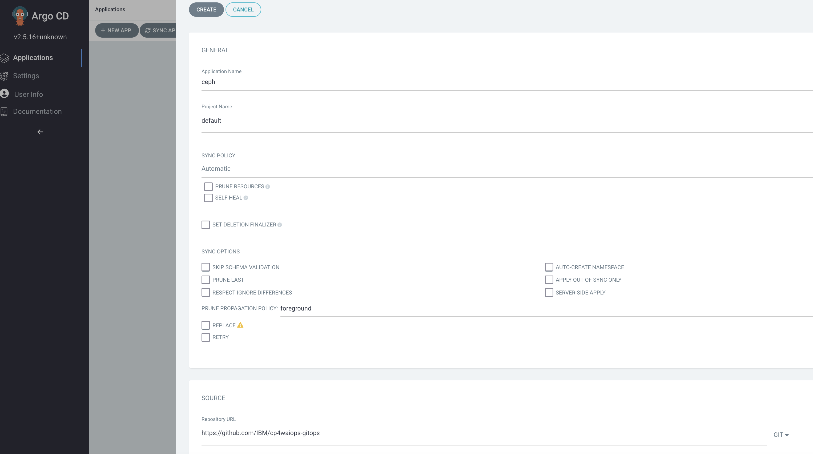

<!-- START doctoc generated TOC please keep comment here to allow auto update -->
<!-- DON'T EDIT THIS SECTION, INSTEAD RE-RUN doctoc TO UPDATE -->
**Table of Contents** *generated with [DocToc](https://github.com/thlorenz/doctoc)*

- [Deploy IBM Cloud Pak for Watson AIOps 4.1 using GitOps](#deploy-cloud-pak-for-watson-aiops-36-using-gitops)
    - [Prerequisites](#prerequisites)
    - [Installing Cloud Pak for Watson AIOps with the Argo CD UI](#installing-cloud-pak-for-watson-aiops-with-the-argo-cd-ui)
        - [Log in to Argo CD](#log-in-to-argo-cd)
        - [Grant Argo CD cluster admin permission](#grant-argo-cd-cluster-admin-permission)
        - [Configure Argo CD](#configure-argo-cd)
        - [Storage considerations](#storage-considerations)
        - [Obtain an entitlement key](#obtain-an-entitlement-key)
        - [Update the OpenShift Container Platform global pull secret](#update-the-openshift-container-platform-global-pull-secret)
        - [Installing AI Manager and Event Manager separately](#installing-ai-manager-and-event-manager-separately)
            - [Install shared components](#install-shared-components)
            - [Install AI Manager](#install-ai-manager)
            - [Install Event Manager](#install-event-manager)
        - [Verify the Cloud Pak for Watson AIOps installation](#verify-the-cloud-pak-for-watson-aiops-installation)
        - [Access Cloud Pak for Watson AIOps](#access-cloud-pak-for-watson-aiops)
    - [Installing Cloud Pak for Watson AIOps from the command line](#installing-cloud-pak-for-watson-aiops-from-the-command-line)
        - [Log in to Argo CD (CLI)](#log-in-to-argo-cd-cli)
        - [Grant Argo CD cluster admin permission (CLI)](#grant-argo-cd-cluster-admin-permission-cli)
        - [Storage considerations (CLI)](#storage-considerations-cli)
        - [Obtain an entitlement key (CLI)](#obtain-an-entitlement-key-cli)
        - [Update the OpenShift Container Platform global pull secret (CLI)](#update-the-openshift-container-platform-global-pull-secret-cli)
        - [Installing AI Manager and Event Manager separately (CLI)](#installing-ai-manager-and-event-manager-separately-cli)
            - [Install shared components (CLI)](#install-shared-components-cli)
            - [Install AI Manager (CLI)](#install-ai-manager-cli)
            - [Install Event Manager (CLI)](#install-event-manager-cli)
        - [Verify the Cloud Pak for Watson AIOps installation (CLI)](#verify-the-cloud-pak-for-watson-aiops-installation-cli)
        - [Access Cloud Pak for Watson AIOps (CLI)](#access-cloud-pak-for-watson-aiops-cli)
    - [Troubleshooting](#troubleshooting)
        - [Storage](#storage)
            - [Problem](#problem)
            - [Cause](#cause)
            - [Solution](#solution)

<!-- END doctoc generated TOC please keep comment here to allow auto update -->

# Deploy IBM Cloud Pak for Watson AIOps 4.1 using GitOps

**Using GitOps to install Cloud Pak for Watson AIOps 4.1 is a GA feature!**

The use of GitOps enables IBM Cloud Pak for Watson AIOps to be deployed on a Red Hat OpenShift Container Platform cluster from a Git repository, with the ArgoCD tool. Cloud Pak for Watson AIOps can be installed with the Argo CD user interface (UI), or with the Argo CD command line (CLI).

For more information about GitOps, see [Understanding OpenShift GitOps](https://docs.openshift.com/container-platform/4.10/cicd/gitops/understanding-openshift-gitops.html#understanding-openshift-gitops) in the Red Hat OpenShift documentation.

For more information about Argo, see the [Argo documentation](https://argo-cd.readthedocs.io/en/stable/).

<!--You can choose from two deployment options:

Option 1: Install AI Manager and Event Manager separately

Option 2: Install AI Manager and Event Manager with an all-in-one configuration (**Technology preview**) -->

## Prerequisites

- Ensure that you meet the supported platform, hardware, and storage requirements. For more information, see [System requirements](https://www.ibm.com/docs/en/cloud-paks/cloud-pak-watson-aiops/4.1.0?topic=planning-system-requirements).
- You must have Red Hat OpenShift GitOps (Argo CD) installed on your Red Hat OpenShift cluster. For more information, see [Installing OpenShift GitOps](https://docs.openshift.com/container-platform/4.10/cicd/gitops/installing-openshift-gitops.html) in the Red Hat OpenShift documentation.

## Installing Cloud Pak for Watson AIOps with the Argo CD UI

### Log in to Argo CD

From your Red Hat OpenShift console, click the menu on the upper right, and select `Cluster Argo CD`.


The Argo CD UI is displayed. Click `LOG IN VIA OPENSHIFT`.


### Grant Argo CD cluster admin permission

From the Red Hat OpenShift console, go to `User Management` > `RoleBindings` > `Create binding`. Use the form view to configure the properties for the `ClusterRoleBinding` with the following values and then click `Create`.

- Binding type  
    - Cluster-wide role binding (ClusterRoleBinding)  
- RoleBinding  
    - Name: argocd-admin  
- Role  
    - Role Name: cluster-admin  
- Subject > ServiceAccount
    - Subject namespace: openshift-gitops  
    - Subject name: openshift-gitops-argocd-application-controller  

### Configure Argo CD

From the Argo CD UI, click `NEW APP`, input the following parameters, and then click `CREATE`.

- GENERAL  
    - Application Name: argocd  
    - Project: default  
    - SYNC POLICY: Automatic  
- SOURCE  
    - Repository URL : https://github.com/IBM/cp4waiops-gitops  
    - Revision: release-4.1  
    - path: config/argocd/openshift  
- DESTINATION   
    - Cluster URL: https://kubernetes.default.svc  
    - Namespace: openshift-gitops  

After the Argo CD App `argocd` is created, select the App from the Argo CD UI to view the topology of all of the resources.

### Storage considerations

You must use a supported storage provider. For more information about supported storage, see [Storage Considerations](https://www.ibm.com/docs/en/cloud-paks/cloud-pak-watson-aiops/4.1.0?topic=requirements-storage). If your Red Hat OpenShift cluster already has a single default supported storage class, then skip this step.

<!--If you are deploying on AWS, then EFS (Amazon Elastic File System) can be used for persistent storage. For more information, see [Getting started with Amazon Elastic File System](https://docs.aws.amazon.com/efs/latest/ug/getting-started.html) in the AWS documentation. You can also refer to the [AWS EFS storage configuration example](aws-efs-config-example.md)-->

**Note**: Multiple default storage classes cause deployment problems. Run the following command to check your cluster's storage class.

```bash
oc get sc
```

If your cluster has multiple default storage classes, then you must edit your storage classes to leave only one storage class as the default. To remove the default setting from a storage class, run the following command to edit the storage class, and then delete the `storageclass.kubernetes.io/is-default-class: "true"` line under `annotations`.

```
oc edit sc [STORAGE-CLASS-NAME]
```

This tutorial sets up and uses Ceph storage for demonstration purpose. 

From the Argo CD UI, click `NEW APP`, input the following parameters for Ceph, and then click `CREATE`.

- GENERAL
    - Application Name: ceph
    - Project: default
    - SYNC POLICY: Automatic
- SOURCE
    - Repository URL : https://github.com/IBM/cp4waiops-gitops
    - Revision: release-4.1
    - path: config/ceph
- DESTINATION
    - Cluster URL: https://kubernetes.default.svc
    - Namespace: rook-ceph



After the Argo CD App `ceph` is created, you can click the App from the Argo CD UI to view the topology of the Ceph resources as follows:


The filters on the left can be used to filter out resources. Click a resource to check its logs and events.


Run the following command from the command line to check that none of the pods have an error status.

```console
[root@xyz.test.cp.fyre.ibm.com ~]# oc get po -n rook-ceph
NAME                                                              READY   STATUS      RESTARTS   AGE
csi-cephfsplugin-7b6jk                                            3/3     Running     0          2d
csi-cephfsplugin-l7mvz                                            3/3     Running     0          2d
csi-cephfsplugin-provisioner-695b574445-gfcwz                     6/6     Running     6          2d
csi-cephfsplugin-provisioner-695b574445-lb64p                     6/6     Running     7          2d
csi-cephfsplugin-qcsqz                                            3/3     Running     0          2d
csi-cephfsplugin-qdrtl                                            3/3     Running     0          2d
csi-cephfsplugin-wj7qq                                            3/3     Running     0          2d
csi-cephfsplugin-xlsnb                                            3/3     Running     0          2d
csi-rbdplugin-8xwdb                                               3/3     Running     0          2d
csi-rbdplugin-b6t9l                                               3/3     Running     0          2d
csi-rbdplugin-h965f                                               3/3     Running     0          2d
csi-rbdplugin-lv2hp                                               3/3     Running     0          2d
csi-rbdplugin-pqvrc                                               3/3     Running     0          2d
csi-rbdplugin-provisioner-7f9847cd48-48gqk                        6/6     Running     0          2d
csi-rbdplugin-provisioner-7f9847cd48-wxh2z                        6/6     Running     12         2d
csi-rbdplugin-x8cw9                                               3/3     Running     0          2d
rook-ceph-crashcollector-worker0.body.cp.fyre.ibm.com-88f5bnbdc   1/1     Running     0          2d
rook-ceph-crashcollector-worker1.body.cp.fyre.ibm.com-d4c7gdcts   1/1     Running     0          2d
rook-ceph-crashcollector-worker2.body.cp.fyre.ibm.com-7767p8fxm   1/1     Running     0          2d
rook-ceph-crashcollector-worker3.body.cp.fyre.ibm.com-6c5cqs4lk   1/1     Running     0          2d
rook-ceph-crashcollector-worker4.body.cp.fyre.ibm.com-787f99czf   1/1     Running     0          2d
rook-ceph-crashcollector-worker5.body.cp.fyre.ibm.com-94d4b654q   1/1     Running     0          2d
rook-ceph-mds-myfs-a-7d48d48497-sbhld                             1/1     Running     0          2d
rook-ceph-mds-myfs-b-66f4b746c7-2fnl2                             1/1     Running     0          2d
rook-ceph-mgr-a-5c84cd7b7b-574lf                                  1/1     Running     0          2d
rook-ceph-mon-a-7b947ddf45-74p49                                  1/1     Running     0          2d
rook-ceph-mon-b-7cf885c589-5j6r9                                  1/1     Running     0          2d
rook-ceph-mon-c-bcb6575d8-g9l5w                                   1/1     Running     0          2d
rook-ceph-operator-54649856c4-cdx24                               1/1     Running     0          2d
rook-ceph-osd-0-c44985597-gwkqk                                   1/1     Running     0          2d
rook-ceph-osd-1-6f7d5cc955-v4862                                  1/1     Running     0          2d
rook-ceph-osd-2-58df99c46f-5kl8z                                  1/1     Running     0          2d
rook-ceph-osd-3-5c8579456c-bpcqz                                  1/1     Running     0          2d
rook-ceph-osd-4-5668c69fbf-kvdf6                                  1/1     Running     0          2d
rook-ceph-osd-5-cbbdb95-cqvjd                                     1/1     Running     0          2d
rook-ceph-osd-prepare-worker0.body.cp.fyre.ibm.com-bxr7t          0/1     Completed   0          4h16m
rook-ceph-osd-prepare-worker1.body.cp.fyre.ibm.com-fftd8          0/1     Completed   0          4h16m
rook-ceph-osd-prepare-worker2.body.cp.fyre.ibm.com-scg84          0/1     Completed   0          4h16m
rook-ceph-osd-prepare-worker3.body.cp.fyre.ibm.com-m488b          0/1     Completed   0          4h16m
rook-ceph-osd-prepare-worker4.body.cp.fyre.ibm.com-dxcm5          0/1     Completed   0          4h16m
rook-ceph-osd-prepare-worker5.body.cp.fyre.ibm.com-jclnq          0/1     Completed   0          4h16m
```

If any of the pods are in an error state, you can check the logs by using `oc logs`.

### Obtain an entitlement key

Obtain your IBM Entitled Registry key to enable your deployment to pull images from the IBM Entitled Registry.

1. Obtain the entitlement key that is assigned to your IBMid. Log in to [MyIBM Container Software Library](https://myibm.ibm.com/products-services/containerlibrary) with the IBMid and password details that are associated with the entitled software.

2. In the "Entitlement key" section, select "Copy key" to copy the entitlement key to the clipboard.

3. Copy the entitlement key to a safe place so that you can use it later when you update the global pull secret for the cluster.

4. (Optional) Verify the validity of the key by logging in to the IBM Entitled Registry.

   Depending on the container system that you are using, you might need to use `docker login` instead of `podman login` for the following command.

   ```sh
   export IBM_ENTITLEMENT_KEY=the key from the previous steps
   podman login cp.icr.io --username cp --password "${IBM_ENTITLEMENT_KEY:?}"
   ```

### Update the OpenShift Container Platform global pull secret

1. From the Red Hat OpenShift console, select the "Administrator" perspective, and then select "Workloads > Secrets".

2. Select the project "openshift-config". <!--(for latest version ocp, the `Show default projects` switch under `Project:` need to be enabled before selecting project.)-->

3. Select the object "pull-secret".

4. Click "Actions > Edit secret".

5. Scroll to the end of the page and click "Add credentials". Use the following values:

     - "Registry Server Address" cp.icr.io
     - "Username": cp
     - "Password": paste the entitlement key that you copied from the [Obtain an entitlement key](#obtain-an-entitlement-key) step
     - "Email": email address. This field is mostly a hint to other people who might see the entry in the configuration.

     **Note**: The registry user for this secret is "cp", not the name or email of the user who owns the entitlement key.

6. Click "Save".

For more information, see [Update the OpenShift Container Platform global pull secret](https://docs.openshift.com/container-platform/4.10/openshift_images/managing_images/using-image-pull-secrets.html) in the Red Hat OpenShift documentation.

### Installing AI Manager and Event Manager separately

#### Install shared components

- GENERAL
    - Application Name: anyname (for example: "cp-shared")
    - Project: default
    - SYNC POLICY: Automatic
- SOURCE
    - Repository URL : https://github.com/IBM/cp4waiops-gitops
    - Revision: release-4.1
    - path: config/cp-shared/operators
- DESTINATION
    - Cluster URL: https://kubernetes.default.svc
    - Namespace: openshift-marketplace
- PARAMETERS
    - spec.imageCatalog: icr.io/cpopen/ibm-operator-catalog:latest
    - spec.catalogName: ibm-operator-catalog
    - spec.catalogNamespace: openshift-marketplace


#### Install AI Manager

Install AI Manager by using GitOps to create an Argo CD App for AI Manager. The parameters for AI Manager are as follows:

- GENERAL
    - Application Name: anyname (for example: "aimanager-app")
    - Project: default
    - SYNC POLICY: Automatic
- SOURCE
    - Repository URL : https://github.com/IBM/cp4waiops-gitops
    - Revision: release-4.1
    - path: config/cp4waiops/install-aimgr
- DESTINATION
    - Cluster URL: https://kubernetes.default.svc
    - Namespace: cp4waiops
- PARAMETERS
    - spec.storageClass: rook-cephfs  *(you must update this value to be the RWX storage class that is being used in your environment. You can find this by running the command `oc get sc`.)*
    - spec.storageClassLargeBlock: rook-cephfs  *(you must update this value to be the RWO storage that is being used in your environment. You can find this by running the command `oc get sc`.)*
    - spec.aiManager.channel: v4.1
    - spec.aiManager.size: small
    - spec.aiManager.namespace: cp4waiops
    - spec.aiManager.pakModules.aiopsFoundation.enabled: true
    - spec.aiManager.pakModules.applicationManager.enabled: true
    - spec.aiManager.pakModules.aiManager.enabled: true
    - spec.aiManager.pakModules.connection.enabled: true

NOTE: If you use a repository that is forked from the official [Cloud Pak for Watson AIOps GitOps repository](https://github.com/IBM/cp4waiops-gitops) or a different branch, then you must update the values of the `Repository URL` and `Revision` parameters to match your repository and branch. For example, if you use `https://github.com/<myaccount>/cp4waiops-gitops` and `dev` branch, then these two parameters must be changed.

#### Install Event Manager

Install Event Manager by using GitOps to create an Argo CD App for Event Manager. The parameters for Event Manager are as follows:

- GENERAL
    - Application Name: anyname (for example: "eventmanager-app")
    - Project: default
    - SYNC POLICY: Automatic
- SOURCE
    - Repository URL : https://github.com/IBM/cp4waiops-gitops
    - Revision: release-4.1
    - path: config/cp4waiops/install-emgr
- DESTINATION
    - Cluster URL: https://kubernetes.default.svc
    - Namespace: noi 
- PARAMETERS
    - spec.imageCatalog: icr.io/cpopen/ibm-operator-catalog:latest
    - spec.storageClass: rook-cephfs  *(you must update this value to be the RWX storage class that is being used in your environment. You can find this by running the command `oc get sc`.)*
    - spec.storageClassLargeBlock: rook-cephfs  *(you must update this value to be the RWO storage class that is being used in your environment. You can find this by running the command `oc get sc`.)*
    - spec.eventManager.version: 1.6.8
    - spec.eventManager.clusterDomain: <domain_name>
    - spec.eventManager.channel: v1.12
    - spec.eventManager.deploymentType: trial
    - spec.eventManager.namespace: noi

Where `<domain_name>` is the domain name of the cluster where Event Manager is installed. You must use a fully qualified domain name (FQDN). For example, `apps.clustername.abc.xyz.com`. You can retrieve the FQDN by running the following command:

  ```bash
  INGRESS_OPERATOR_NAMESPACE=openshift-ingress-operator
  appDomain=`oc -n ${INGRESS_OPERATOR_NAMESPACE} get ingresscontrollers default -o yaml | yq .status.domain`
  echo ${appDomain}
  ```

**Note**:
- If you use a repository that is forked from the official [Cloud Pak for Watson AIOps GitOps repository](https://github.com/IBM/cp4waiops-gitops) or a different branch, then you must update the values of the `Repository URL` and `Revision` parameters to match your repository and branch. For example, if you use `https://github.com/<myaccount>/cp4waiops-gitops` and `dev` branch, then these two parameters must be changed.

<!--### Option 2: (**Technology preview**) Installing AI Manager and Event Manager with an all-in-one configuration 

**NOTE:** This option is a technology preview, and must not be used for production systems.

#### Installing AI Manager and Event Manager together

The all-in-one configuration enables the installation of the following components in one go.

- Ceph storage (optional)
- AI Manager
- Event Manager

When you create the Argo CD app, complete the form with the following values.

| Field                 | Value                                                 |
| --------------------- | ----------------------------------------------------- |
| Application Name      | anyname (for example cp4waiops-app)                          |
| Project               | default                                               |
| Sync Policy           | Automatic                                             |
| Repository URL        | https://github.com/IBM/cp4waiops-gitops               |
| Revision              | release-4.1                                                  |
| Path                  | config/all-in-one                                     |
| Cluster URL           | https://kubernetes.default.svc                        |
| Namespace             | openshift-gitops                                      |

You can also update the following parameters to customize the installation.

| Parameter                             | Type   | Default Value      | Description 
| ------------------------------------- |--------|--------------------|-------------
| argocd.cluster                        | string | openshift          | The type of the cluster that Argo CD runs on.Valid values include: openshift, kubernetes.
| argocd.allowLocalDeploy               | bool   | true               | Allow apps to be deployed on the same cluster where Argo CD runs.
| rookceph.enabled                      | bool   | true               | Specify whether to install Ceph as storage used by Cloud Pak for Watson AIOps.
| cp4waiops.version                     | string | v4.1               | Specify the version of Cloud Pak for Watson AIOps v4.1.
| cp4waiops.profile                     | string | small              | The Cloud Pak for Watson AIOps deployment profile: x-small, small, or large.
| cp4waiops.aiManager.enabled           | bool   | true               | Specify whether to install AI Manager.
| cp4waiops.aiManager.namespace         | string | cp4waiops          | The namespace where AI Manager is installed.
| cp4waiops.aiManager.instanceName      | string | aiops-installation | The instance name of AI Manager.
| cp4waiops.eventManager.enabled        | bool   | true               | Specify whether to install Event Manager.
| cp4waiops.eventManager.namespace      | string | noi                | The namespace where Event Manager is installed.
| cp4waiops.eventManager.clusterDomain  | string | REPLACE_IT         | The domain name of the cluster where Event Manager is installed.

NOTE:

- `cp4waiops.profile` The profile `x-small` is only suitable for demonstrations and proof-of-concept deployments. Production environments must use a `small` or `large` profile.
- `cp4waiops.eventManager.enabled` This must be false if you have a value of `x-small` for `cp4waiops.profile`, as this profile size is only suitable for deployments of AI Manager, and not for deployments of AI Manager and Event Manager.
- `cp4waiops.eventManager.clusterDomain` This is the domain name of the cluster where Event Manager is installed. Use a fully qualified domain name (FQDN). For example, `apps.clustername.abc.xyz.com`.
-->
<!--
#### Installing Cloud Pak for Watson AIOps using a custom build

The all-in-one configuration enables a custom build of Cloud Pak for Watson AIOps to be installed by providing a specific image catalog and channel.

Use the installation parameters listed in following table when you create the Argo CD App.

| Parameter                           | Type   | Default Value                             | Description 
| ----------------------------------- |--------|-------------------------------------------|-----------------------------------
| cp4waiops.aiManager.imageCatalog    | string | icr.io/cpopen/ibm-operator-catalog:latest | The image catalog for AI Manager.
| cp4waiops.aiManager.channel         | string | v4.1                                      | The subscription channel for AI Manager.
| cp4waiops.eventManager.imageCatalog | string | icr.io/cpopen/ibm-operator-catalog:latest | The image catalog for Event Manager.
| cp4waiops.eventManager.channel      | string | v1.10                                     | The subscription channel for Event Manager.

These parameters are invisible when you create the Argo CD App from the UI, but you can add them in the `HELM` > `VALUES` field when you are completing the form.

For example, adding the following YAML snippet to the `HELM` > `VALUES` field installs AI Manager and Event Manager with a custom `imageCatalog` and `channel`:

```yaml
cp4waiops:
  aiManager:
    imageCatalog: <my_custom_image_catalog_for_ai_manager>
    channel: <my_custom_channel_for_ai_manager>
  eventManager:
    imageCatalog: <my_custom_image_catalog_for_event_manager>
    channel: <my_custom_channel_for_event_manager>
```

The all-in-one configuration also exposes some more installation parameters that are not visible from the UI that enable further customization of the installation. The following table lists some of these parameters. To find out more about the usage of these parameters, see [Cloud Pak for Watson AIOps Customized Install Options Using GitOps](./cp4waiops-custom-install.md).

| Parameter                             | Type   | Default Value | Description 
| ------------------------------------- |--------|---------------|-----------------------------------
| cp4waiops.storageClass                | string | rook-cephfs   | The storage class for Cloud Pak for Watson AIOps to use.
| cp4waiops.storageClassLargeBlock      | string | rook-cephfs   | The storage class for large block for Cloud Pak for Watson AIOps to use.
| cp4waiops.eventManager.version        | string | 1.6.6         | The version of Event Manager.
| cp4waiops.eventManager.deploymentType | string | trial         | The deployment type of Event Manager, valid values include: trial, production.
| globalImagePullSecrets                | array  | n/a           | A list of registry secrets that are needed for pulling images during the installation.

For example, if the custom build to be installed includes images from registries other than the official IBM Entitled Registry, you can use `globalImagePullSecrets` to specify all the necessary information to access these registries, such as registry URL, username, and password.

These parameters are invisible when you create the Argo CD App from the UI, but you can add them in the `HELM` > `VALUES` field when you are completing the form. For example,

```yaml
globalImagePullSecrets:
- registry: <my_own_registry_1>
  username: <username_to_registry_1>
  password: <password_to_registry_1>
- registry: <my_own_registry_2>
  username: <username_to_registry_2>
  password: <password_to_registry_2>
```
-->
### Verify the Cloud Pak for Watson AIOps installation

When Ceph and Cloud Pak for Watson AIOps are ready, you can see these Apps with a status of `Healthy` and `Synced` in the Argo CD UI.


You can check the topology of Cloud Pak for Watson AIOps from the Argo CD UI as follows:


You can also check your Cloud Pak for Watson AIOps installation from the command line. For example, to check the AI Manager pods, run the following command:

```console
# oc get po -n cp4waiops
NAME                                                              READY   STATUS      RESTARTS        AGE
aimanager-aio-ai-platform-api-server-7d48c6dd89-6bn9t             1/1     Running     0               3h33m
aimanager-aio-change-risk-bd78c587c-fhg67                         1/1     Running     0               3h33m
aimanager-aio-chatops-orchestrator-6d897b4497-7xjwt               1/1     Running     0               3h33m
aimanager-aio-chatops-slack-integrator-5b8dcb9785-flcs9           1/1     Running     0               3h33m
aimanager-aio-chatops-teams-integrator-8d586fc7f-h5bpg            1/1     Running     0               3h33m
aimanager-aio-controller-5f7d877f-9zxfj                           1/1     Running     0               3h33m
aimanager-aio-cr-api-865c8f8f85-bthhw                             1/1     Running     0               3h33m
aimanager-aio-create-certificate-k9zmp                            0/1     Completed   0               3h36m
aimanager-aio-create-luigi-prereqs-glmrz                          0/1     Completed   0               3h33m
aimanager-aio-create-postgres-database-68j48                      0/1     Completed   0               3h35m
aimanager-aio-create-secrets-lkd69                                0/1     Completed   0               3h35m
aimanager-aio-create-truststore-k66d8                             0/1     Completed   0               3h34m
aimanager-aio-curator-job-28004340-sp9sl                          0/1     Completed   0               178m
aimanager-aio-curator-job-28004400-qt45t                          0/1     Completed   0               118m
aimanager-aio-curator-job-28004460-4phlp                          0/1     Completed   0               58m
aimanager-aio-log-anomaly-detector-6bc99f9988-kj6kh               1/1     Running     0               3h33m
aimanager-aio-log-anomaly-detector-6bc99f9988-mf8kb               1/1     Running     0               3h33m
aimanager-aio-log-anomaly-feedback-learning-6d848588c7-9ptg7      1/1     Running     0               3h33m
aimanager-aio-luigi-daemon-0                                      1/1     Running     0               3h33m
aimanager-aio-oob-recommended-actions-f6fd5465d-dzhqv             1/1     Running     0               3h33m
aimanager-aio-pruning-job-28004340-6f94t                          0/1     Completed   0               178m
aimanager-aio-pruning-job-28004400-z9xm2                          0/1     Completed   0               118m
aimanager-aio-pruning-job-28004460-p5j2b                          0/1     Completed   0               58m
aimanager-aio-similar-incidents-service-68597967fb-s7jbg          1/1     Running     0               3h33m
aimanager-ibm-minio-0                                             1/1     Running     0               3h33m
aimanager-operator-controller-manager-c49879bc-w69md              1/1     Running     0               4h33m
aiops-ai-model-ui-7bcff98898-j7x9q                                1/1     Running     0               4h7m
aiops-akora-ui-7c4f67dc8f-dvdw6                                   1/1     Running     0               4h2m
aiops-application-details-ui-api-56655575f-whz6w                  1/1     Running     0               4h2m
aiops-base-ui-5596f5dbf9-d8rmj                                    1/1     Running     0               4h6m
aiops-connections-ui-589b76885-qtkl5                              1/1     Running     0               4h7m
aiops-insights-pg-setup-bvnsv                                     0/1     Completed   0               3h50m
aiops-insights-ui-api-6cfbf4779c-5n2hj                            1/1     Running     0               3h50m
aiops-insights-ui-datarouting-7dfdf6c5bc-xc8sn                    1/1     Running     1 (3h45m ago)   3h50m
aiops-insights-ui-f9fc67876-lk4fz                                 1/1     Running     0               4h7m
aiops-installation-edb-postgres-1                                 1/1     Running     0               4h33m
aiops-ir-analytics-cassandra-setup-96mhh                          0/1     Completed   0               3h48m
aiops-ir-analytics-classifier-5f78f877db-nrgf8                    1/1     Running     0               3h38m
aiops-ir-analytics-metric-action-8658f45c78-kncld                 1/1     Running     2 (3h30m ago)   3h37m
aiops-ir-analytics-metric-api-6796c5594b-ctw84                    1/1     Running     0               3h38m
aiops-ir-analytics-metric-spark-59c45f6b55-zv4pr                  1/1     Running     0               3h38m
aiops-ir-analytics-probable-cause-initialisation-lrftt            0/3     Completed   0               3h45m
aiops-ir-analytics-probablecause-84c7d88f48-ldlzf                 1/1     Running     0               3h37m
aiops-ir-analytics-spark-master-75bbc97cc-dwgr5                   1/1     Running     0               3h37m
aiops-ir-analytics-spark-pipeline-composer-7ccf698df8-xskx9       1/1     Running     1 (3h31m ago)   3h37m
aiops-ir-analytics-spark-worker-0                                 1/1     Running     0               3h37m
aiops-ir-analytics-spark-worker-1                                 1/1     Running     0               3h33m
aiops-ir-analytics-xiny-initialisation-2dlvj                      0/1     Completed   0               3h38m
aiops-ir-core-archiving-7f9d8d9fb7-shz2z                          1/1     Running     0               3h36m
aiops-ir-core-archiving-setup-264bx                               0/1     Completed   0               3h47m
aiops-ir-core-cem-users-7b7748cfbd-4j8fq                          1/1     Running     0               3h36m
aiops-ir-core-datarouting-5f744668b5-xflcb                        1/1     Running     0               3h36m
aiops-ir-core-esarchiving-5bc58f5c64-7glrr                        1/1     Running     0               3h36m
aiops-ir-core-ncobackup-0                                         2/2     Running     0               3h37m
aiops-ir-core-ncodl-api-84f6697d4d-b4s7h                          1/1     Running     0               3h36m
aiops-ir-core-ncodl-cjob-tdata-28004460-xm7k6                     0/1     Completed   0               58m
aiops-ir-core-ncodl-if-d76449d68-25qb4                            1/1     Running     0               3h36m
aiops-ir-core-ncodl-jobmgr-669bf484cd-crvgk                       1/1     Running     0               3h36m
aiops-ir-core-ncodl-presetup-2bwtx                                0/1     Completed   0               3h47m
aiops-ir-core-ncodl-setup-hts29                                   0/1     Completed   0               3h34m
aiops-ir-core-ncodl-std-576558c484-8blgp                          1/1     Running     0               3h36m
aiops-ir-core-ncoprimary-0                                        1/1     Running     0               3h40m
aiops-ir-core-rba-as-864d9596f9-lpgv6                             1/1     Running     0               3h36m
aiops-ir-core-rba-rbs-7f7d4fb4c-pwxs4                             1/1     Running     0               3h36m
aiops-ir-core-usercfg-5ddbdfc9c4-h6njm                            1/1     Running     0               3h36m
aiops-ir-core-usercfg-presetup-6p7fz                              0/1     Completed   0               3h47m
aiops-ir-lifecycle-create-policies-job-x526x                      0/1     Completed   0               3h43m
aiops-ir-lifecycle-datarouting-66cf4cd87-xtk5w                    1/1     Running     0               3h43m
aiops-ir-lifecycle-eventprocessor-ep-jobmanager-0                 2/2     Running     0               3h45m
aiops-ir-lifecycle-eventprocessor-ep-taskmanager-0                1/1     Running     0               3h44m
aiops-ir-lifecycle-policy-grpc-svc-7cd87f4644-nhsc9               1/1     Running     0               3h39m
aiops-ir-lifecycle-policy-registry-svc-7ccf749948-klxw5           1/1     Running     1 (3h40m ago)   3h43m
aiops-ir-lifecycle-policy-registry-svc-job-4tggl                  0/1     Completed   0               3h43m
aiops-ir-ui-api-graphql-dc6896488-4ccvh                           1/1     Running     0               4h2m
aiops-topology-cassandra-0                                        1/1     Running     0               3h48m
aiops-topology-cassandra-auth-secret-generator-f5ns6              0/1     Completed   0               3h49m
aiops-topology-file-observer-6f6586649b-mfzf7                     1/1     Running     0               3h30m
aiops-topology-inventory-5ddfb9fbd5-2bhgc                         1/1     Running     0               3h30m
aiops-topology-inventory-schema-bdtqh                             0/1     Completed   0               3h33m
aiops-topology-kubernetes-observer-d7bc69989-wz7l9                1/1     Running     0               3h30m
aiops-topology-layout-7dcd79b585-57ls4                            1/1     Running     0               3h30m
aiops-topology-merge-f579ddc98-2mh99                              1/1     Running     0               3h30m
aiops-topology-observer-service-769cbcb68d-4hrwc                  1/1     Running     0               3h30m
aiops-topology-rest-observer-666cc7b874-wtb2p                     1/1     Running     0               3h30m
aiops-topology-servicenow-observer-546c86fff4-dtzvm               1/1     Running     0               3h30m
aiops-topology-sevone-observer-7cc9954459-x96c9                   1/1     Running     0               3h30m
aiops-topology-status-668cf96f65-7v4c9                            1/1     Running     0               3h30m
aiops-topology-topology-74c6c6864c-cjtjk                          1/1     Running     0               3h30m
aiops-topology-ui-api-d5bcd664f-n69zc                             1/1     Running     0               3h30m
aiops-topology-vmvcenter-observer-854b549747-fvrlf                1/1     Running     0               3h30m
aiopsedge-instana-topology-integrator-867db845b8-lsvg6            1/1     Running     0               3h50m
aiopsedge-operator-controller-manager-58885dd575-dck2k            1/1     Running     2 (4h24m ago)   4h33m
aiopsedge-operator-controller-manager-58885dd575-qscdq            1/1     Running     2 (4h27m ago)   4h33m
asm-operator-9966456b8-mtmk8                                      1/1     Running     0               4h33m
c-example-couchdbcluster-m-0                                      2/2     Running     0               3h43m
c-example-redis-m-0                                               4/4     Running     0               4h31m
c-example-redis-m-1                                               4/4     Running     0               4h31m
c-example-redis-m-2                                               4/4     Running     0               4h31m
c-example-redis-s-0                                               4/4     Running     0               4h26m
c-example-redis-s-1                                               4/4     Running     0               4h26m
c-example-redis-s-2                                               4/4     Running     0               4h26m
check-aiops-prereqs-7bdpz                                         0/1     Completed   0               4h43m
configure-aiops-network-policy-q4qqb                              0/1     Completed   0               4h42m
connector-bridge-58ccbf8cd4-8hhkr                                 1/1     Running     1 (3h48m ago)   3h50m
connector-manager-d8649b9c9-bvjc6                                 1/1     Running     0               4h21m
connector-orchestrator-56b78565cc-nlqq9                           1/1     Running     0               3h50m
cp4waiops-connectors-deploy-69784d7658-h2wjg                      1/1     Running     0               4h22m
cp4waiops-eventprocessor-eve-29ee-ep-jobmanager-0                 2/2     Running     0               3h28m
cp4waiops-eventprocessor-eve-29ee-ep-taskmanager-0                1/1     Running     0               3h28m
cp4waiops-metricsprocessor-789fccfc47-9x2q5                       1/1     Running     0               4h21m
create-secrets-job-sjckp                                          0/1     Completed   0               4h28m
gateway-kong-config-svc-28004510-6j4n5                            0/1     Completed   0               8m28s
gateway-kong-f999c794b-7mlzs                                      2/2     Running     0               4h31m
gateway-kong-post-install-resources-5b554                         0/1     Completed   0               4h31m
iaf-core-operator-controller-manager-568cfb459b-2czwd             1/1     Running     0               4h40m
iaf-eventprocessing-operator-controller-manager-6b6f6f758cvxb68   1/1     Running     1 (4h37m ago)   4h40m
iaf-flink-operator-controller-manager-b7b9ccb99-jb75p             1/1     Running     0               4h40m
iaf-operator-controller-manager-bc6458cf5-wcn84                   1/1     Running     0               4h40m
iaf-system-elasticsearch-es-aiops-0                               2/2     Running     0               4h22m
iaf-system-entity-operator-5fc7c64f56-xrh7d                       3/3     Running     0               4h18m
iaf-system-kafka-0                                                1/1     Running     0               4h20m
iaf-system-zookeeper-0                                            1/1     Running     0               4h23m
iaf-zen-tour-job-xbb96                                            0/1     Completed   0               3h53m
iam-config-job-7cxv8                                              0/1     Completed   0               4h
ibm-aiops-orchestrator-controller-manager-54688c665-p2fkb         1/1     Running     0               4h38m
ibm-cloud-databases-redis-operator-8b8978d84-h74rb                1/1     Running     0               4h33m
ibm-common-service-operator-7664b948b8-cwlz6                      1/1     Running     1 (4h40m ago)   4h40m
ibm-elastic-operator-controller-manager-f98ffdd48-mrrdf           1/1     Running     0               4h40m
ibm-ir-ai-operator-controller-manager-7776894cb5-jldzv            1/1     Running     0               4h33m
ibm-kong-operator-57f47b648d-d47ql                                1/1     Running     0               4h33m
ibm-nginx-cdd99b479-lkx6h                                         1/1     Running     0               3h54m
ibm-nginx-cdd99b479-tf9nm                                         1/1     Running     0               3h54m
ibm-nginx-tester-6676c6b8c6-dsk2s                                 1/1     Running     0               4h4m
ibm-secure-tunnel-operator-57d7766796-h7xmv                       1/1     Running     0               4h33m
ibm-vault-deploy-consul-0                                         1/1     Running     0               4h21m
ibm-vault-deploy-vault-0                                          1/1     Running     0               4h21m
ibm-vault-deploy-vault-injector-5d86877867-7dntk                  1/1     Running     0               4h21m
ibm-vault-operator-controller-manager-fdcf4b74d-g4gxj             1/1     Running     0               4h28m
ibm-watson-aiops-ui-operator-controller-manager-8fb86db7b-cdf6n   1/1     Running     11 (4h8m ago)   4h33m
ir-core-operator-controller-manager-64d9777669-qq94s              1/1     Running     0               4h33m
ir-lifecycle-operator-controller-manager-69bdd94544-5nsgt         1/1     Running     0               4h33m
post-aiops-resources-d9nqp                                        0/1     Completed   0               4h7m
post-aiops-translations-qmpb5                                     0/1     Completed   0               4h7m
post-aiops-update-user-role-csbwc                                 0/1     Completed   2               4h7m
setup-nginx-job-26rql                                             0/1     Completed   0               4h11m
sre-tunnel-controller-0                                           1/1     Running     0               4h26m
sre-tunnel-tunnel-network-api-7c6596d94f-g4sbb                    1/1     Running     0               4h29m
sre-tunnel-tunnel-ui-mcmtunnelui-7877465766-lgzph                 1/1     Running     0               4h29m
usermgmt-6b976464f-6vf76                                          1/1     Running     0               4h
usermgmt-6b976464f-mrv8z                                          1/1     Running     0               4h
zen-audit-59ff87c7dc-fwwbj                                        1/1     Running     0               4h8m
zen-core-7fd5cff5c6-2ppfz                                         1/1     Running     0               4h8m
zen-core-7fd5cff5c6-f8pww                                         1/1     Running     0               4h8m
zen-core-api-55594899d7-d2p95                                     1/1     Running     0               4h8m
zen-core-api-55594899d7-ndd6t                                     1/1     Running     0               4h8m
zen-metastoredb-0                                                 1/1     Running     0               4h19m
zen-metastoredb-1                                                 1/1     Running     0               4h19m
zen-metastoredb-2                                                 1/1     Running     0               4h19m
zen-metastoredb-certs-xxx6g                                       0/1     Completed   0               4h24m
zen-metastoredb-init-c4j2p                                        0/1     Completed   0               4h19m
zen-pre-requisite-job-xm8cf                                       0/1     Completed   0               4h11m
zen-watcher-9f8b6c975-tlvcc                                       1/1     Running     0               4h8m
```

If any pods are in an error state, you can check the logs from the Argo CD UI, or you can run `oc logs` from the command line.

### Access Cloud Pak for Watson AIOps

If all of the pods for Cloud Pak for Watson AIOps are up and running, then you can log in to the Cloud Pak for Watson AIOps UI as follows.

Log in to the Red Hat OpenShift console, and then click the drop-down menu on the upper right.


Click the `IBM Cloud Pak for Administration` link, and select `OpenShift authentication`.


Log in to `IBM Cloud Pak for Administration`, click the drop-down menu on the upper right, and then select `IBM Automation (cp4waiops)`.


Log in to the Cloud Pak for Watson AIOps UI and then select `OpenShift authentication`.


The Cloud Pak for Watson AIOps user interface is displayed.


Congratulations! You are ready to play with Cloud Pak for Watson AIOps!

## Installing Cloud Pak for Watson AIOps from the command line

### Log in to Argo CD (CLI)

Make sure that the Argo CD CLI (`argocd` command) is installed. For more information, see the [Argo documentation](https://argo-cd.readthedocs.io/en/stable/cli_installation/).

Then, run the following commands to log in to Argo CD:

```sh
argo_route=openshift-gitops-server
argo_secret=openshift-gitops-cluster
sa_account=openshift-gitops-argocd-application-controller

argo_pwd=$(oc get secret ${argo_secret} \
            -n openshift-gitops \
            -o jsonpath='{.data.admin\.password}' | base64 -d ; echo ) \
&& argo_url=$(oc get route ${argo_route} \
               -n openshift-gitops \
               -o jsonpath='{.spec.host}') \
&& argocd login "${argo_url}" \
      --username admin \
      --password "${argo_pwd}" \
      --insecure
```

#### Grant Argo CD cluster admin permission (CLI)

Apply the following YAML manifest to the cluster where Argo CD runs:

```yaml
kind: ClusterRoleBinding
apiVersion: rbac.authorization.k8s.io/v1
metadata:
  name: argocd-admin
subjects:
  - kind: ServiceAccount
    name: openshift-gitops-argocd-application-controller
    namespace: openshift-gitops
roleRef:
  apiGroup: rbac.authorization.k8s.io
  kind: ClusterRole
  name: cluster-admin
```

### Storage considerations (CLI)

You must use a supported storage provider. For more information about supported storage, see [Storage Considerations](https://www.ibm.com/docs/en/cloud-paks/cloud-pak-watson-aiops/4.1.0?topic=requirements-storage). If your Red Hat OpenShift cluster already has a single default supported storage class, then skip this step.

**Note**: Multiple default storage classes cause deployment problems. Run the following command to check your cluster's storage class.

```bash
oc get sc
```

If your cluster has multiple default storage classes, then you must edit your storage classes to leave only one storage class as the default. To remove the default setting from a storage class, run the following command to edit the storage class, and then delete the `storageclass.kubernetes.io/is-default-class: "true"` line under `annotations`.

```
oc edit sc [STORAGE-CLASS-NAME]
```

This tutorial sets up and uses Ceph storage for demonstration purpose. 

To create an Argo CD App for Ceph storage, run the following command:

```sh
argocd app create ceph \
  --sync-policy automatic \
  --project default \
  --repo https://github.com/IBM/cp4waiops-gitops.git \
  --path config/ceph \
  --revision release-4.1 \
  --dest-namespace rook-ceph \
  --dest-server https://kubernetes.default.svc
```

### Obtain an entitlement key (CLI)

Obtain your IBM Entitled Registry key to enable your deployment to pull images from the IBM Entitled Registry.

1. Obtain the entitlement key that is assigned to your IBMid. Log in to [MyIBM Container Software Library](https://myibm.ibm.com/products-services/containerlibrary) with the IBMid and password details that are associated with the entitled software.

2. In the "Entitlement key" section, select "Copy key" to copy the entitlement key to the clipboard.

3. Copy the entitlement key to a safe place so that you can use it later when you update the global pull secret for the cluster.

4. (Optional) Verify the validity of the key by logging in to the IBM Entitled Registry.

   Depending on the container system that you are using, you might need to use `docker login` instead of `podman login` for the following command.

   ```sh
   export IBM_ENTITLEMENT_KEY=the key from the previous steps
   podman login cp.icr.io --username cp --password "${IBM_ENTITLEMENT_KEY:?}"
   ```

### Update the OpenShift Container Platform global pull secret (CLI)

Run the following command to create the entitlement key pull secret:

```
oc create secret docker-registry ibm-entitlement-key \
    --docker-username=cp \
    --docker-password=<entitlement-key> \
    --docker-server=cp.icr.io \
    --namespace=cp4waiops
```

Where `<entitlement-key>` is the entitlement key that you copied in the previous step.

### Installing AI Manager and Event Manager separately (CLI)

#### Install shared components (CLI)

```sh
argocd app create cp-shared \
      --sync-policy automatic \
      --project default \
      --repo https://github.com/IBM/cp4waiops-gitops.git \
      --path config/cp-shared/operators \
      --revision release-4.1 \
      --dest-namespace openshift-marketplace \
      --dest-server https://kubernetes.default.svc \
      --helm-set spec.imageCatalog=icr.io/cpopen/ibm-operator-catalog:latest \
      --helm-set spec.catalogName=ibm-operator-catalog \
      --helm-set spec.catalogNamespace=openshift-marketplace
```

#### Install AI Manager (CLI)

Run the following command to install AI Manager by using GitOps to create an Argo CD App for AI Manager.

```sh
argocd app create aimanager-app \
      --sync-policy automatic \
      --project default \
      --repo https://github.com/IBM/cp4waiops-gitops.git \
      --path config/cp4waiops/install-aimgr \
      --revision release-4.1 \
      --dest-namespace cp4waiops \
      --dest-server https://kubernetes.default.svc \
      --helm-set spec.storageClass=rook-cephfs \
      --helm-set spec.storageClassLargeBlock=rook-cephfs \
      --helm-set spec.aiManager.namespace=cp4waiops \
      --helm-set spec.aiManager.channel=v4.1 \
      --helm-set spec.aiManager.size=small \
      --helm-set spec.aiManager.pakModules.aiopsFoundation.enabled=true \
      --helm-set spec.aiManager.pakModules.applicationManager.enabled=true \
      --helm-set spec.aiManager.pakModules.aiManager.enabled=true \
      --helm-set spec.aiManager.pakModules.connection.enabled=true
```

**Important**: You must update the values of spec.storageClass and storageClassLargeBlock to be the RWX and RWO storage classes that are being used in your environment. You can find this by running the command `oc get sc`.

#### Install Event Manager (CLI)

Run the following command to install Event Manager by using GitOps to create an Argo CD App for Event Manager.

```sh
argocd app create eventmanager-app \
      --sync-policy automatic \
      --project default \
      --repo https://github.com/IBM/cp4waiops-gitops.git \
      --path config/cp4waiops/install-emgr \
      --revision release-4.1 \
      --dest-namespace noi \
      --dest-server https://kubernetes.default.svc \
      --helm-set spec.imageCatalog=icr.io/cpopen/ibm-operator-catalog:latest \
      --helm-set spec.storageClass=rook-cephfs \
      --helm-set spec.storageClassLargeBlock=rook-cephfs \
      --helm-set spec.eventManager.namespace=noi \
      --helm-set spec.eventManager.channel=v1.12 \
      --helm-set spec.eventManager.version=1.6.8 \
      --helm-set spec.eventManager.clusterDomain=<domain_name> \
      --helm-set spec.eventManager.deploymentType=trial
```

**Important**:
- You must update the values of spec.storageClass and storageClassLargeBlock to be the RWX and RWO storage classes that are being used in your environment. You can find this by running the command `oc get sc`.
- `<domain_name>` must be the domain name of the cluster where Event Manager is installed. Use a fully qualified domain name (FQDN). For example, `apps.clustername.abc.xyz.com`. You can also retrieve the FDQN by running the following command:

  ```bash
  INGRESS_OPERATOR_NAMESPACE=openshift-ingress-operator
  appDomain=`oc -n ${INGRESS_OPERATOR_NAMESPACE} get ingresscontrollers default -o yaml | yq .status.domain`
  echo ${appDomain}
  ```

### Verify the Cloud Pak for Watson AIOps installation (CLI)

Run the following command to verify that the Cloud Pak for Watson AIOps installation was successful:

```sh
oc get application -A
```

Example output from a successful installation:

```console
# oc get application -A
NAMESPACE          NAME                      SYNC STATUS   HEALTH STATUS
openshift-gitops   cp4waiops                 Synced        Healthy
openshift-gitops   in-cluster-aimanager      Synced        Healthy
openshift-gitops   in-cluster-eventmanager   Synced        Healthy
openshift-gitops   in-cluster-rook-ceph      Synced        Healthy
```

Wait for a while and then run the following commands to verify that all of the pods in the `cp4waiops` and `noi` namespaces are running.

```
oc get pod -n cp4waiops
oc get pod -n noi
```

### Access Cloud Pak for Watson AIOps (CLI)

If all of the pods for Cloud Pak for Watson AIOps are up and running, then you can log in to the Cloud Pak for Watson AIOps UI as follows.

Log in to the Red Hat OpenShift console, and then click the drop-down menu on the upper right.


Click the `IBM Cloud Pak for Administration` link, and select `OpenShift authentication`.


Log in to `IBM Cloud Pak for Administration`, click the drop-down menu on the upper right, and then select `IBM Automation (cp4waiops)`.


Log in to the Cloud Pak for Watson AIOps UI and then select `OpenShift authentication`.


The Cloud Pak for Watson AIOps user interface is displayed.


Congratulations! You are ready to play with Cloud Pak for Watson AIOps!

## Troubleshooting

### Storage

#### Problem

Ceph pod reports the following error:

`cephosd: failed to lookup binary path "/rootfs/usr/sbin/lvm" on the host rootfs`.

#### Cause

This problem is caused by missing lvm2 support. For more information, see [issue 6705](https://github.com/rook/rook/issues/6057#issuecomment-681732903).

#### Solution

Install lvm2 on all Red Hat OpenShift nodes.
