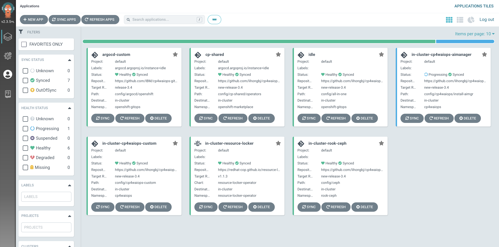
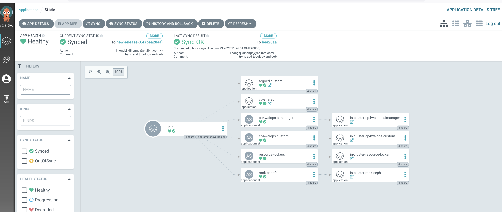

<!-- START doctoc generated TOC please keep comment here to allow auto update -->
<!-- DON'T EDIT THIS SECTION, INSTEAD RE-RUN doctoc TO UPDATE -->
**Table of Contents**  *generated with [DocToc](https://github.com/thlorenz/doctoc)*

- [Deploy custom sizing CP4WAIOps using GitOps](#deploy-custom-sizing-cp4waiops-using-gitops)
  - [Prerequisite](#prerequisite)
    - [Obtain an entitlement key](#obtain-an-entitlement-key)
    - [Update the OCP global pull secret](#update-the-ocp-global-pull-secret)
      - [Update the global pull secret using the OpenShift console](#update-the-global-pull-secret-using-the-openshift-console)
  - [Install custom sizing CP4WAIOps from UI](#install-custom-sizing-cp4waiops-from-ui)
    - [Login to Argo CD](#login-to-argo-cd)
    - [Grant Argo CD Cluster Admin Permission](#grant-argo-cd-cluster-admin-permission)
    - [Install custom sizing CP4WAIOps Using All-in-One Configuration](#install-custom-sizing-cp4waiops-using-all-in-one-configuration)
      - [Install AI Manager and Event Manager in One Go](#install-ai-manager-and-event-manager-in-one-go)
      - [Install *x-small* custom sizing CP4WAIOps](#install-x-small-custom-sizing-cp4waiops)
      - [Install *x-small-idle* custom sizing CP4WAIOps](#install-x-small-idle-custom-sizing-cp4waiops)
      - [Install *x-small-custom* custom sizing CP4WAIOps](#install-x-small-custom-custom-sizing-cp4waiops)
      - [Install custom sizing CP4WAIOps using *Custom Build*](#install-custom-sizing-cp4waiops-using-custom-build)
    - [Verify CP4WAIOps Installation](#verify-cp4waiops-installation)
    - [Access CP4WAIOps](#access-cp4waiops)

<!-- END doctoc generated TOC please keep comment here to allow auto update -->

# Deploy custom sizing CP4WAIOps using GitOps

## Prerequisite

- To learn CP4WAIOps system requirement, please refer to [System requirements for Cloud Pak for Watson AIOps](https://www.ibm.com/docs/en/cloud-paks/cloud-pak-watson-aiops/3.3.0?topic=planning-system-requirements).
- To install OpenShift GitOps (Argo CD) on OpenShift cluster, please refer to [Installing OpenShift GitOps](https://docs.openshift.com/container-platform/4.8/cicd/gitops/installing-openshift-gitops.html).

### Obtain an entitlement key

If you don't already have an entitlement key to the IBM Entitled Registry, obtain your key using the following instructions:

1. Go to the [Container software library](https://myibm.ibm.com/products-services/containerlibrary).

1. Click "Copy key."

1. Copy the entitlement key to a safe place so you can use it when updating the global pull secret for the cluster.

1. (Optional) Verify the validity of the key by logging in to the IBM Entitled Registry using a container tool:  
   Depending on what contianer system you are using, you might need to use `docker login` instead of `podman login` for following commands.

   ```sh
   export IBM_ENTITLEMENT_KEY=the key from the previous steps
   podman login cp.icr.io --username cp --password "${IBM_ENTITLEMENT_KEY:?}"
   ```

### Update the OCP global pull secret

[Update the OCP global pull secret](https://docs.openshift.com/container-platform/4.7/openshift_images/managing_images/using-image-pull-secrets.html) with the entitlement key.

Keep in mind that the registry user for that secret is `cp`. A common mistakes is to assume the registry user is the name or email of the user owning the entitlement key.

#### Update the global pull secret using the OpenShift console

1. Navigate to the "Workloads > Secrets" page in the "Administrator" perspective.

1. Select the object "pull-secret".

1. Click on "Actions -> Edit secret".

1. Scroll to the bottom of that page and click on "Add credentials", using the following values for each field:

   - "Registry Server Address" `cp.icr.io`
   - "Username": `cp`
   - "Password": paste the entitlement key you copied from the [Obtain an entitlement key](#obtain-an-entitlement-key) setp
   - "Email": any email, valid or not, will work. This fields is mostly a hint to other people who may see the entry in the configuration

1. Click on "Save"


## Install custom sizing CP4WAIOps from UI

### Login to Argo CD

You can now login to Argo CD UI as follows by clicking the drop down menu on top right.


Argo CD UI will be popped up and you can login using `LOG IN VIA OPENSHIFT`.


### Grant Argo CD Cluster Admin Permission

From Red Hat OpenShift Console, go to `User Management` > `RoleBindings` > `Create binding`. Use the form view to configure the properties for the `ClusterRoleBinding` with values as follows, and click the `Create` button.

- Binding type
  - Cluster-wide role binding (ClusterRoleBinding)
- RoleBinding
  - Name: argocd-admin
- Role
  - Role Name: cluster-admin
- Subject
  - ServiceAccount: check it
  - Subject namespace: openshift-gitops
  - Subject name: openshift-gitops-argocd-application-controller


### Install custom sizing CP4WAIOps Using All-in-One Configuration


#### Install AI Manager and Event Manager in One Go

The all-in-one configuration allows you to install following components in one go:

- Ceph storage (optional)
- AI Manager
- Event Manager

For AI Manager, you can specify the installation profile or sub-profile of small with custom sizing, including:

- large
- small
- extra small: sub-profile requesting much less cpu and memory, only for demo, PoC, or dev environment in a resource (cpu and memory) limited cluster.
  - x-small
  - x-small-idle
  - x-small-custom
  
 And support SNO (Single Nodw OCP).  	 

Just fill in the form using the suggested field values listed in following table when you create the Argo CD App:

| Field                 | Value                                                 |
| --------------------- | ----------------------------------------------------- |
| Application Name      | anyname (e.g. cp4waiops-app)                          |
| Project               | default                                               |
| Sync Policy           | Automatic                                             |
| Repository URL        | https://github.com/IBM/cp4waiops-gitops               |
| Revision              | release-3.4                                           |
| Path                  | config/all-in-one                                     |
| Cluster URL           | https://kubernetes.default.svc                        |
| Namespace             | openshift-gitops                                      |

In Helm PARAMETERS: specify/override which profile to install:

| Field                 | Value                                                        | Description
| --------------------- | ------------------------------------------------------------ |--------------|
| cp4waiops.profile     | - large<br>- small  <br>- x-small or <br>x-small-idle <br>- x-small-custom    |x-small are custom sizing|
| cp4waiops.eventManager.enabled        |false               | Specify whether or not to install Event Manager.|


Besides the `cp4waiops.profile`,  you can also update the following install parameters that are commonly used to customize the install behavior.

| Parameter                             | Type   | Default Value      | Description 
| ------------------------------------- |--------|--------------------|-------------
| argocd.cluster                        | string | openshift          | The type of the cluster that Argo CD runs on, valid values include: openshift, kubernetes.
| argocd.allowLocalDeploy               | bool   | true               | Allow apps to be deployed on the same cluster where Argo CD runs.
| rookceph.enabled                      | bool   | true               | Specify whether or not to install Ceph as storage used by CP4WAIOps.
| cp4waiops.version                     | string | v3.4               | Specify the version of CP4WAIOps, e.g.: v3.2, v3.3, v3.4.
| cp4waiops.profile                     | string | small              | The CP4WAIOps deployment profile, e.g.: x-small, small, large.
| cp4waiops.aiManager.enabled           | bool   | true               | Specify whether or not to install AI Manager.
| cp4waiops.aiManager.namespace         | string | cp4waiops          | The namespace where AI Manager is installed.
| cp4waiops.aiManager.instanceName      | string | aiops-installation | The instance name of AI Manager.
| cp4waiops.eventManager.enabled        | bool   | true               | Specify whether or not to install Event Manager.
| cp4waiops.eventManager.namespace      | string | noi                | The namespace where Event Manager is installed.
| cp4waiops.eventManager.clusterDomain  | string | REPLACE_IT         | The domain name of the cluster where Event Manager is installed.

NOTE:

- For `cp4waiops.profile`, the profile `x-small` is only for demo, PoC, or dev environment. If you are looking for official installation, use profile such as `small` or `large` instead.
- For `cp4waiops.eventManager.enabled`, it needs to be false if you use `x-small` profile as it only covers AI Manager, not including Event Manager.
- For `cp4waiops.eventManager.clusterDomain`, it is the domain name of the cluster where Event Manager is installed. Use fully qualified domain name (FQDN), e.g.: apps.clustername.abc.xyz.com.

Besides that, the all-in-one configuration exposes a few more install parameters invisible from UI that allows you to customize the install behavior in a more fine-grained manner. Below is just a list of some available parameters. To learn more on the usage of such parameters, please refer to [CP4WAIOps Customized Install Options Using GitOps](./cp4waiops-custom-install.md).

| Parameter                             | Type   | Default Value | Description 
| ------------------------------------- |--------|---------------|-----------------------------------
| cp4waiops.storageClass                | string | rook-cephfs   | The storage class for CP4WAIOps to use.
| cp4waiops.storageClassLargeBlock      | string | rook-cephfs   | The storage class for large block for CP4WAIOps to use.
| globalImagePullSecrets                | array  | n/a           | A list of registries for image pull when needed during the install.

For example, if the custom build to be installed includes images from registries other than the official IBM entitled registry, you can use `globalImagePullSecrets` to specify all necessary information for these registries including registry URLs, as well as username and password to access these registries.

Again, since these parameters are invisible, you can add them when filling in the form in `HELM` > `VALUES` field:

```yaml
globalImagePullSecrets:
- registry: <my_own_registry_1>
  username: <username_to_registry_1>
  password: <password_to_registry_1>
- registry: <my_own_registry_2>
  username: <username_to_registry_2>
  password: <password_to_registry_2>
```


#### Install *x-small* custom sizing CP4WAIOps 
| Field                          | Value         | Description
| ------------------------------ | ------------- |--------------------------|
| cp4waiops.profile              | x-small       | x-small are custom sizing|
| cp4waiops.eventManager.enabled |false          | not install eventmanager |


#### Install *x-small-idle* custom sizing CP4WAIOps 
| Field                          | Value         | Description
| ------------------------------ | ------------- |--------------------------|
| cp4waiops.profile              | x-small-idle  | x-small are custom sizing|
| cp4waiops.eventManager.enabled |false          | not install eventmanager |


#### Install *x-small-custom* custom sizing CP4WAIOps 
| Field                          | Value                   | Description|
| ------------------------------ | ------------- |--------------------------|
| cp4waiops.profile              | x-small-custom| x-small are custom sizing|
| cp4waiops.eventManager.enabled |false          | not install eventmanager |


#### Install custom sizing CP4WAIOps using *Custom Build*

The all-in-one configuration also allows you to install CP4WAIOps using custom build by providing specific image catalog and channel for your custom build.

Just use the install parameters listed in following table when you create the Argo CD App:

| Parameter                           | Type   | Default Value                             | Description 
| ----------------------------------- |--------|-------------------------------------------|-----------------------------------
| cp4waiops.aiManager.imageCatalog    | string | icr.io/cpopen/ibm-operator-catalog:latest | The image catalog for AI Manager.
| cp4waiops.aiManager.channel         | string | v3.4                                      | The subscription channel for AI Manager.


These parameters are invisible when you create the Argo CD App from UI, but you can add them when filling in the form in `HELM` > `VALUES` field.

For example, adding following YAML snippet to `HELM` > `VALUES` field will install AI Manager and Event Manager using custom imageCatalog and channel:

```yaml
cp4waiops:
  imageCatalog: <my_custom_image_catalog_for_ai_manager>
  aiManager:  
    channel: <my_custom_channel_for_ai_manager>
```

### Verify CP4WAIOps Installation

After both Ceph and CP4WAIOps are ready, you will be able to see those Apps from Argo CD UI as follows with status as `Healthy` and `Synced`.





You can check the topology of CP4WAIOps using Argo CD UI as follows:


You can also check from command line as follows, and make sure there are no error pods. If there are some pods in error state, you can check logs either from Argo CD UI or using `kubectl logs` from command line.

For example, to check custom sizing configmap of AI Manager:

```console
$ oc get cm -n cp4waiops | grep aiops-custom-size-profile
aiops-custom-size-profile                            1      16m
```

describe the configmap for more details:

```yaml
# oc describe  cm aiops-custom-size-profile

Name:         aiops-custom-size-profile
Namespace:    cp4waiops
Labels:       argocd.argoproj.io/instance=in-cluster-cp4waiops-custom
Annotations:  argocd.argoproj.io/sync-wave: -1

Data
====
profiles:
----
generatedFor: "NonHA"
automationbase:
  kafka:
    replicas: 1
    config:
      default.replication.factor: 1
      min.insync.replicas: 1
    resources:
      limits:
        cpu: 500m
        memory: 1280Mi
      requests:
        cpu: 150m
        memory: 500Mi
  zookeeper:
    replicas: 1
    resources:
      limits:
        cpu: 1000m
        memory: 256Mi
      requests:
        cpu: 10m
        memory: 128Mi
  elasticsearch:
    env:
      - name: ES_JAVA_OPTS
        value: -Xms512M -Xmx512M
    replicas: 1
    resources:
      limits:
        cpu: 500m
        memory: 1536Mi
      requests:
        cpu: 100m
        memory: 768Mi
    tls-proxy:
    ...
```

### Access CP4WAIOps

If all pods for CP4WAIOps are up and running, you can login to CP4WAIOps UI as follows:

Login to Red Hat OpenShift Console, click the drop down menu on top right.


Click the link to `IBM Cloud Pak for Administration` and login via `OpenShift authentication`.


Login to `IBM Cloud Pak for Administration` and click the drop down menu on top right, then select `IBM Automation (cp4waiops)`.


Login to CP4WAIOps UI via `OpenShift authentication`.


You will be navigated to CP4WAIOps UI.


Congratulations! You are ready to play with CP4WAIOps!

